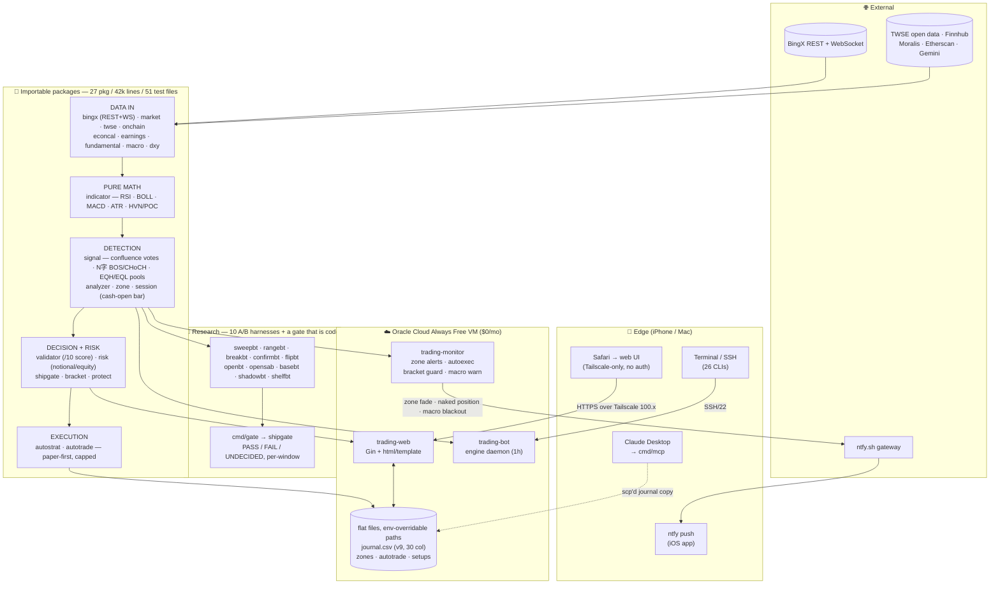

# trading-bot — multi-strategy crypto signal engine in Go

A confluence-based signal generator, backtester, and live-monitoring daemon on
BingX perpetuals. The daemon universe is **BTC, ETH, XAU, XAG**; the CLIs and
the web UI address any of the 14 contracts `market.Resolve` knows, including
the NCSK* US-stock synthetics and the crypto alts that are deliberately kept
out of the daemon.

> 🇹🇼 **繁體中文架構導覽 → [`README.zh-TW.md`](README.zh-TW.md)** — 架構分層、
> 工程決策與取捨、研究工具與 ship gate。安裝與 CLI 細節仍在本檔。

The engine scans for setups where multiple independent technical signals agree (Fibonacci retracement, Bollinger bands, RSI, MACD, liquidity sweeps, RSI/CVD divergence) and emits an executable trade plan: limit entry, stop loss, and two take-profit targets. Runs 24/7 on a $0/month Oracle Cloud VM, alerts to iPhone via ntfy push, exposes a mobile-first web dashboard on Tailscale.

> **This is a research tool, not financial advice.** Backtest results below show thin-but-positive net edge on 1h and 4h timeframes after a 2026-05-27 strategy fix (+83% netR improvement). Do not risk capital without independently verifying the strategy.

---

## 🎯 What this project demonstrates

A personal portfolio project built to deepen Go expertise and showcase production-grade systems thinking. Beyond the trading domain, the codebase exercises patterns that come up directly in senior backend / quant-engineering interviews.

### One-glance architecture



### Engineering decisions & tradeoffs

These are the choices that came out of building, breaking, and fixing the system — the kind of discussion that comes up in deep-dive interview rounds.

| Decision | Why this not that |
|---|---|
| **Sweep close-confirmed invalidation, not just wick-pierced** | The original sweep detector fired on wick-pierce, then never re-evaluated. Backtest revealed it kept emitting LONG signals during the XAG −2.4% dump on 2026-05-27 (stale sweep from earlier bar). Fix: kill the sweep the moment any later candle closes through the swept level in the wrong direction. Result: aggregate **netR +10.91R → +19.97R (+83%)** across 60d on 1h. |
| **HVN / Volume Profile as display-only, NOT a vote** | Intuition said "trade with the chip zone" — but backtest showed enforcing HVN as a confluence vote dropped net edge by diluting score thresholds with marginal setups (BTC −1R, Silver −5.8R). Kept HVN computed and surfaced as `·` lines for trader judgment; engine doesn't vote on it. The discipline of "let the backtest decide" beat the discipline of "trust the intuition." |
| **MTF bias filter behind an opt-in flag (`-bias`)** | Same story: backtest showed enforcing higher-TF MACD direction hurt ETH mean-reversion edge (+6.5R → −2.4R). Made it opt-in for experimentation rather than removing it entirely — preserves the ability to A/B with future data. |
| **Stop refinement (push past HVN clusters) opt-in via `-stop-refine`** | Backtest showed wider stops shrink R-multiples within the 24-bar hold (more timeouts at small loss, fewer 2R winners). BUT the simulator can't model real stop-hunt slippage. Opt-in flag preserves both schools of thought; live data via journal will decide. |
| **Confluence VOTE model, not weighted sum** | Each factor casts ≤1 vote per direction per bar, score = max(bull, bear). Simpler than weighted-sum (fewer hyperparameters to tune, less curve-fitting risk on small samples), and the vote count is interpretable (`LONG(3)` = three independent factors agreed). |
| **CSV journal, not SQLite/Postgres** | One process writing append-mostly rows, the operator hand-edits via `jupdate` aliases. SQLite would force schema migrations as a tool; with CSV I version the schema by column count (v1→v9, currently 30 cols) and auto-migrate on first read. Tradeoff: no concurrent writers, no complex queries — but those don't apply here. |
| **Web UI binds to Tailscale IP, NOT 0.0.0.0** | Three-layer defense (Tailscale CGNAT + ufw + bind-address) — any single breach still leaves two layers intact. No app-level auth needed because the network layer already enforces identity via Wireguard. Senior platform engineering: trust the network primitive when it's strong, don't bolt on weak auth as security theater. |
| **Range expansion bars: voted, demoted, re-promoted** | Originally a vote; demoted to display-only after symbol-regime dependence showed up in one backtest; **re-promoted after an XAG case** where the engine gave a 9.0/10 LONG while a 3-ATR bearish range-expansion bar was being detected but ignored. Subsequent 60-day backtest validated: XAG flipped −8.65R → +0.66R. Lesson: a single backtest window is noisy; revisit decisions when new evidence shows up. |

### Production learnings (the things you only learn by running it)

| Issue | Diagnosis | Fix |
|---|---|---|
| **Daemon timestamps drifting 8h from systemd's** | Go binary defaulted to UTC for `log.Printf`, systemd's journal prefix was Taipei (after `timedatectl set-timezone`). Same line split across two timezones. | `Environment=TZ=Asia/Taipei` in the systemd unit — pass timezone into the process, not just system-wide. |
| **Closing iPhone Terminal# killed the daemon** | `make serve` foreground inherits the SSH session's controlling terminal; SIGHUP propagates on disconnect. | Added `make serve-bg` target with `nohup` + `disown`; documented the "running from iPhone? always use serve-bg" rule. |
| **Stale sweeps continuing to fire during structural breakdowns** | The `LONG score=2 on XAG during −2.4% dump` incident. Sweep detection didn't re-evaluate after the swept level got reclaimed in the wrong direction. | Sweep-invalidation logic: any later candle closing through the swept level in the wrong direction kills the sweep. Documented in [`signal/engine.go`](signal/engine.go) and validated by the +83% backtest improvement. |
| **`journal.csv` lost web-write access after `sudo` edit on VPS** | Editing the file as root flipped ownership to `root:root`; the `ubuntu`-running web daemon could no longer append. | Reflex `chown journal.csv ubuntu:ubuntu` after any `sudo`-touched rewrite; a checklist item now. |
| **Backtest reported edge that didn't appear live** | Look-ahead bias — early version used current-bar high/low for sweep detection (information not yet available at the alert moment). | Added "drop forming candle" helper so live and backtest both see identical inputs at the alert moment. |

### Operational footprint

- **24/7 uptime** on Oracle Cloud Always Free tier (E2.1.Micro, $0/month)
- **systemd-managed** with `Restart=always`, scoped NOPASSWD sudoers for `tstart/tstop/trestart/tconfig`
- **Three-layer security model** (Tailscale CGNAT + ufw + bind-address) for the web UI — see [Security model](#security-model)
- **iPhone-first operator UX** — ntfy push for alerts, SSH aliases for on-demand commands, Tailscale-only web dashboard, partials calculator for multi-leg exits
- **Configuration as data**: daemon TF / min-score live in `/opt/trading/.env`, the systemd unit reads them via `${TRADING_TF}` so `tconfig 15m 3` is the entire change-deploy loop (~1s)

### Tech stack

| Layer | Choice |
|---|---|
| Language | **Go 1.22** (single binary deploy, easy cross-compile to ARM/AMD64) |
| Web framework | Gin + `html/template` (server-side render, no JS framework) |
| Persistence | CSV (auto-migrated v1→v9, 30 cols) |
| Push | ntfy.sh (free) |
| Notifier | Pluggable `Notifier` interface (stdout / macOS Notification Center / ntfy) with `Multi` fan-out |
| Network | Tailscale (Wireguard mesh, free tier) |
| Hosting | Oracle Cloud Always Free (~$0/mo forever) |
| Process supervision | systemd with `Restart=always` |
| Embedded assets | `//go:embed` for templates + CSS — single-binary scp deploy |

### What I'd build next if this were a paid product

1. **Coinglass-style liquidation heatmap provider** (`analyzer/liq_heatmap.go` has the interface, no live provider yet) — bigger data signal than HVN for stop placement.
2. **WebSocket streams** (`bingx/ws.go` stubbed) — sub-second reaction vs current TF-boundary polling.
3. **Real position-size tracker** — leverage column shipped; full `position_size = account_risk / risk_price` calculator + per-symbol risk overrides.
4. **Equity curve + R-distribution histogram** on `/journal` — visual edge tracking beyond the aggregate `jstats` table.
5. **Per-symbol score thresholds** — backtested favorably (XAG=3 helps +11-15R/window across 60/90/120d), held pending live confirmation.

---

## Quick start

The `Makefile` lives in this directory. `cd trading/` once and use `make`:

```bash
cd trading-bot/
make                                # show all available commands
make analyze                        # 1h snapshot of all 4 symbols
make analyze 15m                    # 15m snapshot
make validate BTC long 74500 15m    # score a proposed trade
make serve 15m                      # live monitor (foreground)
make serve-bg 15m                   # live monitor (detached background)
make stop                           # kill the background daemon
make logs                           # tail ~/trading-bot.log
make backtest                       # 60d 1h replay with fee model
make backtest 30 15m                # 30d at 15m
```

> Supported timeframes: `1m`, `5m`, `15m`, `30m`, `1h`, `2h`, `4h`, `1d`. Best edge per the cross-TF backtest below: **1h** (highest 60d gain) and **4h** (only TF positive on all 3 windows). Avoid `15m` and `30m` for live trading — backtest shows fee drag dominates the edge at those scales.

If you prefer raw `go run`, the underlying commands are documented below.

---

## Local setup (first-time config)

All personal values are kept out of tracked files. Fill them in via:

### 1. `.env` (runtime secrets, gitignored)

```bash
cp .env.example .env
$EDITOR .env   # set BINGX_API_KEY (optional), NTFY_TOPIC (required for push alerts)
```

| Variable | Required? | What |
|---|---|---|
| `BINGX_API_KEY` / `BINGX_API_SECRET` | Optional | Only needed for signed BingX endpoints. Public quote/klines work without keys. |
| `NTFY_TOPIC` | Required for push | Pick a hard-to-guess random string (e.g. UUID). Anyone with the topic name can read your alerts. Subscribe to the same topic in the ntfy iOS/Android app. |
| `NTFY_SERVER` | Optional | Override only if you self-host ntfy. Leave blank for the public `ntfy.sh`. |

### 2. Deployment env vars (read by the `Makefile` for VPS targets)

Set these in your shell rc (`~/.zshrc` / `~/.bashrc`) so every `make deploy-*` works:

```bash
export ORACLE_HOST=1.2.3.4                              # your VPS public IP
export ORACLE_USER=ubuntu                               # default already 'ubuntu'
export ORACLE_KEY=$HOME/.ssh/your-vps-key               # path to your SSH private key
```

The `Makefile` declares all three with `?=`, so anything you export in your shell wins over the placeholders.

### 3. Tailscale (optional but recommended)

The web UI is designed to bind to your **Tailscale IP** (looks like `100.x.x.x`), making it reachable from your iPhone/Mac/etc. **without** exposing it to the public internet. Install Tailscale on the VPS and your client devices, sign in to the same tailnet, and:

```bash
# On the VPS, find its Tailscale IP:
tailscale ip -4

# Then set on the VPS:
echo "WEB_BIND=$(tailscale ip -4):8080" | sudo tee -a /etc/systemd/system/trading-bot-web.service.d/env.conf
sudo systemctl daemon-reload && sudo systemctl restart trading-bot-web
```

Replace any `100.x.x.x` you see in this README with your actual Tailscale IP when opening the web UI in a browser.

---

## Make targets

| Command | What it does |
|---|---|
| `make` | Print the help menu |
| `make analyze [TF]` | One-shot snapshot, all 4 symbols, default 1h |
| `make validate SYM SIDE ENTRY [TF]` | Score a user-proposed trade (see `validate` section) |
| `make serve [TF]` | Run the live monitor in foreground (Ctrl+C to stop) |
| `make serve-bg [TF]` | Kill any running serve, rebuild, relaunch detached. Output appended to `~/trading.log` |
| `make stop` | Kill background serve |
| `make logs` | `tail -f ~/trading.log` |
| `make backtest [DAYS] [TF]` | Historical replay with fee model, default 60d 1h |
| `make build` | Rebuild the `/tmp/trading-serve` binary |
| `make jopen SYM SIDE ENTRY STOP TP1 TP2 ANCHOR TF [NOTES]` | Record an opened position to the journal (runs on VPS) |
| `make jclose ID\|SYM OUTCOME EXIT [NOTES]` | Close a trade (outcome: `tp1`/`tp2`/`stop`/`manual`/`timeout`) |
| `make jlist [N]` | Show recent journal entries |
| `make jstats` | Aggregate WR / avgR by symbol / timeframe / anchor |
| `make jupdate ID=<n> SET='field=val ...'` | Modify a journal entry (R auto-recomputed if closed) |
| `make jdelete <id>` | Remove a journal entry |
| `make janchors` | Print recommended ANCHOR values |
| `make tstart` / `make tstop` / `make trestart` | Control the VPS systemd daemon (no password prompt) |
| `make tconfig TF=<tf> MS=<n>` | Change live daemon TF / min-score, restart |
| `make tconfig` | Print current daemon TF / min-score |
| `make deploy` / `make deploy-all` | Push code changes to the Oracle VPS |
| `make deploy-web` | Push web UI changes; restarts the `trading-web` unit |
| `make web-status` / `make web-logs` / `make web-restart` | Operate the web UI remotely |
| `make ssh` / `make remote-status` / `make remote-logs` | Operate the VPS daemon remotely |

Positional args are read in order — no flags needed for common cases. For raw flag access (e.g. custom `-fee-bps`, `-min-score`, `-stop-refine`), call the `go run ./cmd/...` form directly (see the *Commands* section).

---

## Commands

### `cmd/analyze` — one-shot snapshot

Fetches the latest closed candle of `-tf`, runs the engine, prints per-symbol
detail (side, score, N字 structure, HVN/POC, session opens, reasons, warnings,
plan) plus a summary table with the verdict. Use this when you want to know
"what's actionable right now?".

Defaults to `market.All()` — the four-symbol DAEMON universe (BTC/ETH/XAU/XAG).
`-symbols` addresses anything `market.Resolve` knows, including the stock
synthetics and the crypto alts that are deliberately kept out of the daemon
universe:

```bash
go run ./cmd/analyze -symbols BTC,ETH,SUI,SNDK -tf 1h
```

```bash
go run ./cmd/analyze                  # default 1h
go run ./cmd/analyze -tf=15m          # 15-minute snapshot
go run ./cmd/analyze -tf=4h           # 4-hour snapshot
go run ./cmd/analyze -tf=4h -min-score=4   # stricter threshold
go run ./cmd/analyze -bias            # opt into MTF bias filter
```

### `cmd/serve` — live monitor daemon

Runs forever. Wakes 2 seconds after every `-tf` boundary, scans, dedups, pushes alerts to stdout + macOS Notification Center. Only emits when a signal is *tradeable* (`score ≥ -min-score`, sweep-anchored if `-sweep-only`).

```bash
# Default 1h, alerts on score≥3, no sweep filter
go run ./cmd/serve

# Recommended: 1h, score≥3, sweep-only
go run ./cmd/serve -tf=1h -min-score=3 -sweep-only

# Background it
nohup go run ./cmd/serve -tf=1h -min-score=3 -sweep-only > ~/trading-bot.log 2>&1 &

# 15-minute cadence (more frequent alerts; check live trades count first)
go run ./cmd/serve -tf=15m -min-score=3 -sweep-only
```

#### Heartbeat logging

Every scan prints one log line summarizing all 4 symbols — what score each had, the anchor (if any), and whether the alert fired or was skipped (with reason). Example:

```
scan tf=15m  BTC=LONG(3) sweep low @ 77525.6 [FIRED ✓]  ETH=LONG(1) sweep low @ 2122.4 [skipped: score 1 < 3]  XAU=FLAT(0) - [skipped: flat]  XAG=FLAT(0) - [skipped: flat]
```

Status meanings:

| Status | What happened |
|---|---|
| `FIRED ✓` | Alert dispatched (ntfy push sent, journal logged) |
| `FIRED but notify err: ...` | Engine fired but the push failed (rare; usually network) |
| `skipped: flat` | Confluence vote was FLAT — no direction |
| `skipped: score N < M` | Below `-min-score` threshold |
| `skipped: no plan` | Direction set but no usable entry (rare) |
| `skipped: not sweep-anchored` | Met score but anchor is BOLL/fib, blocked by `-sweep-only` |
| `skipped: dedup (already alerted this bar)` | Same `(symbol, candle)` already alerted earlier in this bar's lifetime |
| `error: klines ...` | Couldn't fetch market data (transient) |

This makes "why didn't I get a buzz?" diagnostics trivial — `tlog` shows exactly what each scan saw.

### `cmd/backtest` — historical replay

Pulls `-days` of history at `-tf`, replays the engine, simulates each setup with a fee model. Prints per-symbol stats (WR, net R, max drawdown). Use to validate the strategy before live trading.

```bash
go run ./cmd/backtest                              # default 1h, 60 days
go run ./cmd/backtest -tf=15m -days=30             # 15-min over 30 days
go run ./cmd/backtest -tf=1h -sweep-only           # sweep-only
go run ./cmd/backtest -tf=1h -fee-bps=10           # taker fee assumption
go run ./cmd/backtest -tf=1h -v                    # print every trade
```

### `cmd/validate` — score a proposed trade

Given a symbol, side, entry price, and timeframe, scores **your proposed entry** 0–10 against the engine's current state and HVN structure. Use when you're considering a discretionary entry and want a sanity check.

```bash
go run ./cmd/validate -symbol=BTC -side=long -entry=74500 -tf=1h
go run ./cmd/validate -symbol=XAG -side=short -entry=75.80 -tf=15m
go run ./cmd/validate -symbol=ETH -side=long -entry=2030 -tf=1h -fee-bps=10
```

Symbol aliases: `BTC` / `ETH` / `XAU` or `GOLD` / `XAG` or `SILVER`. Side: `long` / `short` (or `l` / `s`).

**Important:** the score evaluates *your entry*, not the engine's own plan. The engine's independent plan is shown alongside for comparison so you can see whether your entry beats or chases the engine's anchor:

```
Engine's own plan (compare with yours):
  side   SHORT  (anchor: sweep high @ 76753.5000)
  order  LIMIT
  entry  76753.5000   (your entry: 76896.0000 → diff +0.19%)
  stop   77302.8343   (risk 549.3343)
  TP1    76204.1657   (1R)
  TP2    75654.8313   (2R)
```

- Diff *with* your trade direction (e.g., higher entry for a short, lower entry for a long) = you got a better fill than the engine
- Diff *against* your direction = you're chasing — the engine had a better entry available

The block only appears when the engine has its own plan (Side ≠ FLAT). When the engine is flat, your trade is entirely your own thesis — score still computes off your entry and HVN context.

Scoring weights:

| Factor | Points |
|---|---|
| Direction aligned with engine | +2.0 |
| Direction opposes engine | −2.0 |
| Engine score ≥ 3 with same direction | +1.0 |
| Entry at sweep level, correct side | +2.0 |
| Entry at sweep, wrong side | −0.5 |
| Entry at fib 0.618 | +1.5 |
| Entry at BOLL band touch | +0.5 |
| Entry at non-POC HVN, direction-aligned | +1.5 |
| Entry at POC | −1.0 |
| Entry at HVN wrong side | −1.0 |
| POC reachable as TP (0.5–5% in trade direction) | +1.0 |
| POC far away (>5% in trade direction) | −0.5 |
| Fading away from chip zone (POC >2% in wrong direction) | −0.5 |
| Fee math healthy / acceptable / thin / fatal | +1.0 / +0.5 / 0 / −1.5 |

Verdicts: 8+ STRONG TAKE · 6–7.5 TAKE · 4–5.5 NEUTRAL · 2–3.5 WEAK · ≤1.5 AVOID.

Output sections (in order):
1. **Header / Engine state** — engine's independent direction + score
2. **Engine reasons** — what fired in the engine
3. **Engine's own plan** — for comparison with yours (when engine has a plan)
4. **Entry-level proximity** — distances from your entry to sweep / fib / BOLL levels
5. **HVN context** — POC and top-5 HVN distances from your entry
6. **Suggested levels** — stop and TP1/TP2 bracket computed from *your* entry ± 1.5×ATR
7. **Factors** — every scored factor with points and rationale
8. **Total score & Verdict**

### `cmd/journal` — record live trade outcomes

Tracks opened positions and their outcomes to a CSV log. Use to validate whether live results match backtest expectations over time. After ~20–30 closed trades, `journal stats` will tell you if your live avgR roughly matches the backtest avgR — if it does, the strategy is generalizing; if live << backtest, you have look-ahead bias or regime drift.

Stored at `$JOURNAL_PATH` (defaults to `./journal.csv`). On the VPS we set `JOURNAL_PATH=/opt/trading/journal.csv` so all entries are centralized — runs from your iPhone SSH session land in the same file.

#### Open / close a trade

`make jopen` (positional, no flags) handles the common case. For `--score` and `--at` flags, SSH in and call `jopen` directly (the alias on the VPS).

```bash
# Open — SYMBOL SIDE ENTRY STOP TP1 TP2 ANCHOR TF [notes]
make jopen XAG short 77.49 78.16 76.81 76.14 sweep-high 1h "RSI div + chip resistance"

# Open with score + analysis time (via SSH so flags work)
ssh ...; jopen --score=3 --at="2026-05-26 21:00" XAG short 77.49 78.16 76.81 76.14 sweep-high 15m,1h "RSI div, multi-TF"
ssh ...; jopen --score=v7.5 BTC long 75000 74500 75500 76000 sweep-low 1h "validate said TAKE"
ssh ...; jopen --at=-3h ETH long 2120 2098 2142 2164 sweep-low 1h "analyzed 3h before placing"

# Close — ID|SYMBOL OUTCOME EXIT_PRICE [notes]
make jclose XAG tp2 76.14 "hit TP2 in 4h"
make jclose 7 stop 78.18
```

OUTCOME ∈ `{tp1, tp2, stop, manual, timeout}`. R-multiple is computed automatically at close.

Tip: `jopen` flags are recognized as `--name=value` or `--name value`, in any order, but must come **before** the positional args. `tf` accepts comma-separated values when you analyzed multiple timeframes (e.g. `15m,1h`).

#### View / aggregate

```bash
make jlist               # last 20 trades, color-coded
make jlist 50            # last 50

# Aggregate WR / avgR / totalR — overall + grouped by symbol, tf, anchor
make jstats
```

Sample `jlist` output (timestamps in your local zone, full timeline + price ladder visible):

```
ID  ANALYZED          OPENED            CLOSED            SYM  SIDE  TF   SCORE  ENTRY     STOP      TP1       TP2       EXIT      R       STATUS  ANCHOR
2   2026-05-26 01:21  2026-05-26 04:30  2026-05-26 09:36  XAU  SHORT 15m  2      4577.36   4596.05   4558.72   4539.65   4539.65   +2.02   tp2     sweep-high
1   2026-05-24 17:15  2026-05-24 18:05  2026-05-24 22:15  XAG  SHORT 1h   3      77.48     78.16     76.81     76.14     76.13     +1.99   tp2     sweep-high
```

Three timestamp columns:
- **`ANALYZED`** — when you ran `analyze` / `validate` (decision time)
- **`OPENED`** — when the limit order filled
- **`CLOSED`** — when the position closed (empty `-` for open trades)

Four price columns make outcome-vs-plan easy to scan at a glance:
- `ENTRY` / `STOP` — the plan
- `TP1` / `TP2` — the targets you set
- `EXIT` — where the trade actually closed; matching TP2 confirms a 2R win

When you don't pass `--at` to `jopen`, `ANALYZED` matches `OPENED`. When they diverge (e.g. analyzed at 22:00 but limit filled at 04:30), the gap reveals patterns like "did I sit on too many ideas before pulling the trigger?".

#### Edit existing entries

Because make swallows `key=value` tokens as variable assignments, edits use an `ID=` + `SET=` indirection — or just SSH and call `jupdate` directly:

```bash
# From Mac
make jupdate ID=1 SET='entry=77.50 stop=78.20'
make jupdate ID=1 SET='open_notes="RSI div + funding crowd"'
make jupdate ID=1 SET='analyzed_at=-3h'

# From iPhone (after SSH-ing in)
jupdate 1 entry=77.50 stop=78.20
jupdate 1 close_notes="hit TP2 in 4h"
jupdate 1 analyzed_at=2026-05-25T08:00:00Z

make jdelete 7           # nuke entry 7 (cannot be undone)
```

Editable fields:

- **Times** (any time spec — `now`, `-2h`, RFC3339, `YYYY-MM-DD HH:MM`): `opened_at`, `analyzed_at`, `closed_at`
- **Strings:** `side`, `tf`, `anchor`, `open_notes`, `outcome`, `close_notes`
- **Numbers:** `entry`, `stop`, `tp1`, `tp2`, `exit_price`

`id` and `r_realized` are not directly editable (R is auto-recomputed whenever you edit `entry`/`stop`/`exit_price` on a closed trade).

Useful examples:

```bash
# You backfilled the entry with today's timestamp but actually opened yesterday
jupdate 1 opened_at=2026-05-24T15:30:00Z

# Same for the close (the trade closed at a specific UTC time you remember)
jupdate 1 closed_at=2026-05-24T19:45:00Z

# Both timestamps via the make wrapper from Mac
make jupdate ID=1 SET='opened_at=2026-05-24T15:30:00Z closed_at=2026-05-24T19:45:00Z'
```

#### CSV schema (30 columns — current v9)

Versioned by COLUMN COUNT and auto-migrated on read, so an old file keeps
working: v1=16, v2=17 (+analyzed_at), v3=18 (+score), v4=19 (+leverage),
v5=20 (+filled_at), v6=21 (+signal_ctx), v7=23 (+tp1 auto-placement state),
v8=29 (+margin_usdt and entry/stop/tp2 placement state), v9=30 (+equity_usdt).

```
id, opened_at, analyzed_at, closed_at, symbol, side, tf, score,
entry, stop, tp1, tp2,
anchor, open_notes,
exit_price, outcome, r_realized, close_notes,
leverage, filled_at, signal_ctx,
tp1_auto, tp1_order_id, margin_usdt,
entry_order_id, stop_auto, stop_order_id, tp2_auto, tp2_order_id,
equity_usdt
```

`equity_usdt` is the column that makes a row say anything about RISK rather
than about the read. R is leverage-independent by definition, so an R series
is structurally incapable of showing an account going to zero — on 2026-09-08
this file read 66 settled / gross +19.04R while the balance read 0.00000000,
and both were correct. Without equity-at-entry no row and no sum of rows can
say what fraction of the account was on the table.

Four more columns deserve a callout:

| Column | What it captures |
|---|---|
| `analyzed_at` | When you ran `analyze` or `validate` and made the decision. Can predate `opened_at` (e.g. you saw a setup at 8 pm but only opened at 10 pm). Default = same as `opened_at`. Editable via `--at <spec>` on `jopen` or `analyzed_at=<spec>` on `jupdate`. Spec accepts `now`, `-Nh/-Nm/-Nd`, RFC3339, or `YYYY-MM-DD HH:MM`. |
| `tf` | The timeframe(s) you were analyzing when you decided. **Accepts comma-separated values** like `15m,1h` if you saw the same setup on multiple frames. `jstats by tf` groups by exact string, so `15m,1h` and `1h,15m` would be two groups — pick an order and stick with it. |
| **`score`** | The confluence/validate score that drove the decision. **Free-form string with conventions:** `3` or `4` for engine confluence scores from `analyze`; `v7.0` or `v8.5` for `validate` 0–10 scores; `3,v7.0` if you saw it in both; `manual` for discretionary entries; empty if not recorded. Prefix self-identifies the source so `jstats by score` naturally groups by tool. |
| `anchor` | What you were keying entry to. Free-form text, but `jstats` groups by exact string — use canonical labels (run `make janchors` for the list) so groupings stay clean. |

##### Timezone

All timestamps are stored in **Asia/Taipei (UTC+8)** with explicit `+08:00` offset in the CSV. Naive time inputs (no timezone marker) are interpreted as Taipei local time. Both space and `T` separators between date and time are accepted:

```bash
jopen --at="2026-05-26 21:00" ...        # 21:00 Taipei (space separator)
jopen --at=2026-05-26T21:00 ...          # 21:00 Taipei (T separator, no quotes needed)
jupdate 2 closed_at=2026-05-25T12:00     # 12:00 Taipei
jupdate 2 closed_at="2026-05-25 12:00"   # same thing
```

Explicit timezone inputs work too:

```bash
jopen --at=2026-05-26T13:00:00Z ...        # 13:00 UTC = 21:00 Taipei
jopen --at=2026-05-26T21:00:00+08:00 ...   # explicit Taipei offset
```

All accepted formats for `--at` and time fields in `jupdate`:

| Form | Example | Interpreted as |
|---|---|---|
| Relative | `now`, `-2h`, `-30m`, `-1d` | offset from current moment |
| Naive (space) | `2026-05-24 17:15`, `2026-05-24 17:15:00` | Taipei local |
| Naive (T) | `2026-05-24T17:15`, `2026-05-24T17:15:00` | Taipei local |
| Date only | `2026-05-24` | Taipei 00:00 |
| RFC3339 UTC | `2026-05-24T17:15:00Z` | UTC, preserved |
| RFC3339 offset | `2026-05-24T17:15:00+08:00` | Offset preserved |

##### Daemon timestamps in journalctl

For `tlog` / `make remote-logs` to show daemon log lines in the same timezone as systemd's own prefix, set both layers to Asia/Taipei:

```bash
# System-wide (once on the VPS — affects systemctl, journalctl prefixes, date, etc.)
sudo timedatectl set-timezone Asia/Taipei

# Daemon process — pass TZ to the binary via the systemd unit
# Add this line to /etc/systemd/system/trading-bot-bot.service under [Service]:
Environment=TZ=Asia/Taipei
sudo systemctl daemon-reload && sudo systemctl restart trading-bot-bot
```

Without the unit-level `Environment=TZ=...`, the Go binary falls back to UTC in its `log.Printf` output even though systemd's prefix is in Taipei — splits the same line into two timezones, 8 hours apart. The line above keeps everything coherent.

##### Schema migrations

The reader auto-migrates legacy CSVs on first read:

| Version | Columns | Notes |
|---|---|---|
| v1 | 16 | Pre-`analyzed_at`. Migration: `analyzed_at` = `opened_at`, `score` = `""` |
| v2 | 17 | Added `analyzed_at`. Migration: `score` = `""` |
| v3 | 18 | Current. Added `score` after `tf`. |

Old files keep working — first write after read rewrites in v3 form.

#### Anchor reference

Free text technically, but for `jstats` to group meaningfully use these canonical lowercase-hyphen labels:

```bash
make janchors            # or `janchors` after SSH
```

Output (so you don't have to run it):

| Anchor | Meaning |
|---|---|
| `sweep-low` | Long after low-side liquidity grab + reclaim |
| `sweep-high` | Short after high-side grab + reclaim |
| `fib-uptrend` | Long at fib 0.618 in an uptrend |
| `fib-downtrend` | Short at fib 0.618 in a downtrend |
| `boll-lower` / `boll-upper` | Mean-reversion at the Bollinger band |
| `hvn-support` / `hvn-resistance` | Bounce/rejection at a non-POC HVN |
| `daily-open` / `weekly-open` | Reaction at the UTC open |
| `discretionary` / `manual` | Entry not tied to any strategy signal |

Mixed case, plurals, typos create separate groups in `jstats` — be consistent.

#### Win/loss math

`r_realized` is the single source of truth:

- Long: `R = (exit − entry) / (entry − stop)`
- Short: `R = (entry − exit) / (stop − entry)`

A win is `R > 0`, loss is `R < 0`. `jstats` computes WR as `count(R > 0) / total`. Position size and absolute PnL are intentionally outside the journal — R is the strategy-level metric, position sizing is your money-management overlay.

### All flags

| Flag | Default | Used by | Meaning |
|---|---|---|---|
| `-tf` | `1h` | all | Base timeframe: `1m`, `5m`, `15m`, `1h`, `4h`, `1d` |
| `-min-score` | `3` | all | Don't act below this confluence score |
| `-sweep-only` | off | serve, backtest | Restrict to liquidity-sweep–anchored entries |
| `-bias` | off | all | Enable MTF bias filter (off because backtest shows it hurts mean-reversion edge) |
| `-bias-tf` | auto | all | Override the higher-TF used for bias (1h→4h, 5m→1h) |
| `-stop-refine` | off | serve, backtest | Push stop past nearby HVN / equal-level clusters to dodge sweep flows (off — backtest shows R-shrinkage; opt in if you observe live edge) |
| `-fee-bps` | `6` | backtest | Round-trip fee in basis points (4 = both maker, 10 = both taker) |
| `-days` | `60` | backtest | History window |
| `-hold` | `24` | backtest | Max bars before timing out a position |
| `-v` | off | backtest | Print every individual trade |

---

## How to read the output

### `analyze` (snapshot)

```
=== ETH-USDT 1h @ 2122.4300 ===
Side: LONG   Score: 3   Bias: FLAT   Funding: 0.0100%   OI: 480M
HVN (籌碼密集區): POC=2129.4766   nodes=[2129.4766, 2123.4278, 2117.3791, 2135.5253, 2111.3303]
  + Liquidity grab at 2122.43 (low side)
  + RSI bullish divergence
  + Pullback to fib 0.618 in uptrend
  >> LIMIT LONG  entry=2122.4300  stop=2118.9100  risk=3.5200  anchor=sweep low @ 2122.4300
     TP1=2125.9500 (1.0R)
     TP2=2129.4700 (2.0R)
```

→ Place a **limit buy** at `2122.4300` on BingX. Set stop at `2118.9100`. Take 50% off at `TP1`, trail the rest to `TP2`. Don't market in — limit only.

**Line by line:**
- `Side` — engine's direction call (LONG/SHORT/FLAT).
- `Score` — confluence vote count. ≥ 3 with sweep anchor = tradeable.
- `Bias` — higher-timeframe MACD direction; only enforced when `-bias` flag is on.
- `Funding / OI` — perp context. Extreme funding warnings appear as `!` lines.
- `HVN (籌碼密集區)` — Volume Profile from last 200 bars. **POC** is the single price with the most accumulated traded volume; **nodes** are the top-5 high-volume zones (strong S/R). Use these for entry staging and stop placement — they do NOT vote on direction (see "Confluence factors" below for why).
- `+` lines (green) — confluence factors that **fired and voted** on the score.
- `·` lines (cyan) — **display-only observations** (range expansion bars, double top/bottom patterns). These are computed and surfaced for trader context but do **not** vote on the score. See "Display-only data" under *Confluence factors* below.
- `!` lines (yellow) — warnings (crowded funding, OI squeeze, etc.). These don't reduce the score, just flag risk.
- `>>` line — the executable plan.

### Summary table

At the bottom of `analyze` output:

```
SYMBOL              SIDE  SCR BIAS  ENTRY      STOP       TP1        TP2        VERDICT
---------------------------------------------------------------------------------------
BTC-USDT            FLAT  0   FLAT  -          -          -          -          skip — no direction
ETH-USDT            LONG  3   FLAT  2122.43    2118.91    2125.95    2129.47    TRADEABLE — sweep-anchored ✓
NCCOGOLD2USD-USDT   SHORT 2   FLAT  4538.72    4544.16    4533.27    4527.83    borderline — watch for one more confluence
NCCOXAG2USD-USDT    LONG  3   FLAT  76.12      75.79      76.44      76.77      TRADEABLE — sweep-anchored ✓
```

Colors in your terminal: LONG/score≥threshold are bold green, SHORT is bold red, FLAT/skip is dim, TRADEABLE verdict is bold green. Set `NO_COLOR=1` to disable.

Verdict rules:
- `TRADEABLE — sweep-anchored ✓` — score ≥ threshold AND entry is anchored to a liquidity sweep. Highest-edge setup.
- `tradeable but anchor isn't a sweep — size down` — score ≥ threshold but entry uses fib or BOLL anchor. Acceptable but historically lower win rate.
- `borderline — watch` — one shy of threshold. Keep an eye on the next bar.
- `skip` — below threshold or flat.

### `backtest` summary

```
ETH-USDT 1h [sweep-only, fee=6.0bp] | n=27 sig, 27 filled | WR=53.8% | grossR=+7.84 netR=+6.50 avgNet=+0.25 maxDD=3.16R
```

| Field | Meaning |
|---|---|
| `n=27 sig, 27 filled` | 27 score≥threshold setups, all got their limit entry filled |
| `WR=53.8%` | win rate |
| `grossR` | sum of R-multiples before fees |
| `netR` | after fees — **this is the real number** |
| `avgNet` | average R per trade after fees; > 0 = real edge |
| `maxDD` | worst peak-to-trough drawdown in R units (sizing 1% per trade → expect ~maxDD% account drawdown) |

---

## Confluence factors (vote model)

Each factor casts at most one vote per direction per bar. Score = max(bull votes, bear votes).

| Factor | When it votes bull | When it votes bear |
|---|---|---|
| RSI(14) | < 30 | > 70 |
| MACD(12,26,9) | histogram crosses up through zero | crosses down through zero |
| Bollinger(20, 2σ) | close at/below lower band | close at/above upper band |
| Fib 0.618 | price within 0.3% of level in an uptrend | within 0.3% in a downtrend |
| Liquidity sweep **(close-confirmed)** | wick pierced equal-lows AND closed back above AND no later candle closed back below the swept level | wick pierced equal-highs AND closed back below AND no later candle closed back above |
| RSI divergence | bullish regular divergence | bearish regular |
| CVD divergence (if trades available) | bullish regular | bearish regular |
| Range expansion + volume bar | bullish bar with range > 1.5×ATR(14) and vol > 1.5× 20-bar mean | bearish bar with same magnitude |

**Sweep invalidation (2026-05-27 fix):** a detected sweep is killed the moment a later candle closes through the swept level in the wrong direction. Prevents stale sweeps from continuing to fire after structure has already broken. Was the root cause of the XAG `LONG score=2` during the −2.4% dump on 2026-05-27.

**Range expansion (re-promoted 2026-05-27):** originally voted symmetrically, was demoted to display-only because symbol-regime dependent in an earlier backtest. Re-promoted after a XAG case where the engine gave a 9.0/10 LONG *while* a 3-ATR bearish range-expansion bar was being detected but ignored by scoring. Subsequent 60-day backtest on 1h: total netR +10.91 → **+19.97 (+83%)**, XAG flipped from −8.65R to +0.66R.

Context filters (`signal.Context`) downgrade signals — they don't add votes but add `Warnings`:
- Funding > +0.05% per interval → "crowded longs" warning on LONG signals
- Funding < −0.05% → "crowded shorts" warning on SHORT signals
- Open interest dropping > 2% → "squeeze, not real flow"

Display-only data (computed and shown as `·` lines, but does NOT vote):

- **HVN / 籌碼密集區** (Volume Profile) — top-5 high-volume nodes + POC from the last 200 bars. We tested HVN as a confluence vote and it dropped net edge across symbols (`backtest`: BTC −1R, Silver −5.8R) by diluting the score threshold with marginal setups. Surfaced for the trader's eye only — use POC and nodes for entry staging, partial-take placement, and stop selection.
- **MTF bias** — higher-timeframe MACD direction. Same story: backtest shows enforcing it hurts the mean-reversion edge (ETH dropped from +6.5R to −2.4R). Available behind `-bias` flag for experimentation.
- **Double top / double bottom** — pairs of pivot extremes within 0.3% of each other, separated by ≥5 bars, with a ≥1% valley/peak between them. The pattern surfaces only when current price is retesting the level. Backtest showed it as symbol-regime dependent — kept as a note for discretionary reading.
- **Daily / weekly / monthly opens** — opening prices of the current UTC day, week (Mon 00:00), and month. Institutional desks reference these as intraday S/R; price closing back through the daily open often resolves intraday direction. Shows `-` for periods where insufficient candle history is loaded. Use as anchor points for TP refinement and bias context, not for voting.

### Opt-in: stop refinement (清算區 / 流動性獵取)

Push the stop past nearby HVN levels or equal-highs/lows clusters within 0.5×ATR beyond the provisional stop, to dodge obvious sweep flows. Off by default — backtest showed wider stops shrink R-multiples within the 24-bar hold window (more timeouts at small loss, fewer 2R winners). However, the in-theory live benefit of avoiding actual stop hunts cannot be modeled by the R-based simulator (no slippage / wick-then-reverse). Enable with `-stop-refine` on `serve` or `backtest` and observe live outcomes via the journal.

---

## Live backtest results (60 days, 1h, fee = 6bp, stops = 1.5×ATR, min-score=2, sweep-only)

After the 2026-05-27 sweep-invalidation + range-expansion-voting fixes:

| Symbol | n | WR | netR (baseline) | netR (with fixes) | Δ |
|---|---|---|---|---|---|
| BTC-USDT | 68 | 49.2% | +3.75 | **+7.79** | **+4.04** |
| ETH-USDT | 66 | 47.4% | +8.09 | +6.15 | −1.94 |
| NCCOGOLD2USD-USDT (gold) | 72 | 45.2% | +7.72 | +5.37 | −2.35 |
| NCCOXAG2USD-USDT (silver) | 76 | 38.0% | **−8.65** | **+0.66** | **+9.31** |
| **TOTAL** | **282** | | **+10.91R** | **+19.97R** | **+9.06R (+83%)** |

**Reading these:**
- The XAG transformation (−8.65R → +0.66R) is the falling-knife problem disappearing — exactly the case that motivated the fixes.
- BTC also picks up materially (+4.04R) on better-quality sweeps.
- ETH and XAU regress slightly (still solidly positive) — the expected cost of being more selective.
- Gold is no longer the disaster it was — sweep invalidation rehabilitated it on 1h.
- Aggregate **+83% improvement in net R** with one fewer trade in the sample.

### Cross-timeframe comparison (2026-05-29 re-run)

All windows: 4 symbols, sweep-only, min-score=2, fee=6bp, ending 2026-05-29.

| TF | 60d | 90d | 120d | Trades / 60d | Verdict |
|---|---|---|---|---|---|
| 15m (30d only) | **−99.91R** | — | — | ~570 | **Don't trade.** Fee drag + noise crush the edge regardless of fixes. |
| 30m | −29.99 | −88.05 | −69.22 | ~590 | Net negative on every window. XAG-only research possible; XAU is a money fire. |
| **1h** | **+20.77** | −13.31 | −1.45 | ~287 | Highest 60d gain. Degrades on longer windows but stays near break-even. |
| 2h | +4.28 | −7.25 | −10.68 | ~130 | Near-zero edge across windows. |
| **4h** | +9.16 | **+8.21** | **+5.20** | ~53 | **Only TF positive on all 3 windows.** Lower trade count, lower DD, slower edge accumulation. |

**Two strategic choices for the daemon:**

- **1h** — highest absolute return on the 60d window. Trade-count rich (good for accumulating live samples). Use this if you want more signals.
- **4h** — robust positive across all three measurement windows. Slower (one trade per symbol per ~4 days). Use this if you want the strategy to "always be working" rather than oscillating between profitable and breakeven months.

Default in this repo is **1h** because of the 60d edge and signal volume — but 4h is a defensible alternative for a less attention-hungry deployment.

Per-symbol cross-TF pattern (60d):
- **BTC**: positive only on 1h and 4h
- **ETH**: strong on 1h (+14.98), weak elsewhere
- **XAU**: strong on 1h (+5.41) and 4h (+4.23), bleeds heavily on 30m
- **XAG**: positive on **every TF tested** — the most TF-robust symbol

**Recommended daemon config:** `TRADING_TF=1h`, `TRADING_MIN_SCORE=2`, `sweep-only`. Consider `TRADING_TF=4h` if you want fewer alerts and more robust cross-window performance.

---

## Using HVN / 籌碼密集區 as a trader

Volume Profile maps where **executed** trading volume accumulated, by price level. It's a structural map of *positioning* — where participants own positions, where break-even points sit, where stop clusters form.

The engine's score tells you *"is the setup valid?"*. **HVN tells you *"is the trade going to work, and how much?"*.** Two different questions. The engine doesn't vote on HVN (backtest said voting on it hurts), but you should layer it on top of every signal as a discretionary overlay.

### 1. Direction context — read POC vs current price

| Position | Meaning | Implication |
|---|---|---|
| Price **far above POC** | Many positions opened below, now in profit | Demand below; longs have support, shorts face air pocket |
| Price **far below POC** | Many positions opened above, now underwater | **Overhead supply** as price tries to rally; longs fight break-even sellers |
| Price **at POC** | Balance zone — fair value | Expect chop; mean-reversion edge weakest |
| Price **between two HVNs** (low-volume gap) | Air pocket | Expect acceleration — price doesn't dwell here |

### 2. Setup quality filter — sweep direction × HVN side

The single highest-leverage HVN application:

| Setup | HVN context | Verdict |
|---|---|---|
| Sweep HIGH (short) **into an HVN from below** | Best | Trapped longs at HVN + chip resistance = strong reversal |
| Sweep LOW (long) **into an HVN from above** | Best | Trapped shorts at HVN + chip support = strong bounce |
| Sweep into open space (no HVN within ~0.5%) | OK | Sweep works but no amplification |
| Sweep HIGH **already above ALL HVNs** | **Skip** | Chasing into open air, no resistance to fade |
| Sweep LOW **already below ALL HVNs** | **Skip** | Same in reverse |

### 3. POC vs HVN — different roles in your trade

POC and non-POC HVNs sound similar but behave very differently. Don't trade them the same way.

**POC is a TARGET, not an entry.** It's the equilibrium price — the single price where buyers and sellers agreed most often. That means:
- Price isn't extended at POC → no mean-reversion edge to capture
- Two-sided book activity = chop → stops get whipsawed
- The most aggressively defended level → rejection more likely than break

**Non-POC HVNs are valid ENTRIES**, because they represent one-sided positioning (longs trapped above, or shorts trapped below). Reactions there are cleaner.

Direction-by-direction:

| Approach | At POC | At a non-POC HVN |
|---|---|---|
| LONG approaching from below | **Bad** — fading into supply | OK if HVN is acting as resistance for shorts (you're catching the rejection) |
| LONG approaching from above | OK but barely extended | **Best** — clean chip-support bounce |
| SHORT approaching from below | OK (rejection setup) | **Best** — clean chip-resistance rejection |
| SHORT approaching from above | **Bad** — fading into demand | OK if HVN is acting as support that's breaking |

**Where to actually open positions:**

| Zone | Why |
|---|---|
| At a **non-POC HVN** with directional signal aligned | Strong S/R with cleaner reaction than POC's chop |
| In the **LVN gap** between two HVNs | Price moves *fast* through low-volume zones — momentum favorable |
| At a **sweep level distant from POC** | Clean runway toward POC as TP target |
| Just past a **sweep, near a non-POC HVN edge** | Classic smart-money reversal — what the engine is built to detect |

**How to use POC:**
- Long from oversold (below chip zone) → TP1 at first HVN below POC, full exit at POC
- Short from overbought (above chip zone) → TP1 at first HVN above POC, full exit at POC
- Multiple bars clustering AT POC → expect range chop, **disengage mean-reversion entries** until price breaks one side decisively

### 4. Entry refinement

If the engine's entry sits within 0.2% of an HVN, **use the HVN price as your limit** instead. More resting orders exist there → higher fill probability, tighter slippage, cleaner stop placement.

### 5. Stop placement — never inside an HVN

Chip zones produce bounces. A stop inside one gets whipsawed by the noise it generates. Always place stops *past* the HVN by a buffer (0.5×ATR works). If the engine's computed stop lands inside an HVN, manually widen it past the node — costs a few R per losing trade, but win rate jumps noticeably.

### 6. Target / take-profit

Best TP logic: **next HVN in the trade's direction.**

- TP1 = nearest HVN beyond entry
- TP2 = the HVN after that, or POC if you're trading toward it
- If price approaches POC, trim or exit — heaviest reaction zone

The engine's default 1R/2R targets are mechanical and chip-zone-blind. If the next HVN sits at 0.7R, take partial there instead of grinding to 1R and risking a bounce.

### 7. Position sizing modifier

Where HVN really saves money:

| Setup vs HVN context | Risk size |
|---|---|
| Score ≥ 3, sweep-anchored, reacting AT an HVN with aligned direction | **Full size (1% risk)** |
| Score ≥ 3, sweep-anchored, HVN context neutral | Default (0.5% risk) |
| Score ≥ 3, sweep-anchored, but fighting chip-zone overhead | **Quarter size (0.25%) or skip** |
| Score = 2 (borderline) with strong HVN tailwind | Promote to half size (0.5%) |

This is the discretionary overlay backtests can't capture. HVN doesn't vote, but it scales conviction.

### 8. Trade duration estimate

Gap to next HVN ≈ how long the trade will take.

- Wide gap (>3×ATR) → patient management, expect multi-bar move
- Tight gap (<1×ATR) → quick reaction expected, manage actively

### Worked example — Silver 15m LONG (real signal)

Snapshot when the signal fired:
- Entry 75.3070, stop 75.1972 (risk 0.1098), TP1 75.4168, TP2 75.5265
- HVN nodes: 75.72, 75.99, 76.25, **75.46**, 76.52

Reading it:
- Entry is **below** the nearest HVN at 75.46 → long is bouncing *into* a chip zone (target-rich) ✓
- POC at 75.72 sits well above → clean runway up to 75.46, then chip resistance kicks in
- Stop at 75.1972 is below all HVNs → clean placement, no whipsaw risk ✓
- Natural TP refinement: **exit at 75.46** (the HVN) instead of waiting for engine's TP2 at 75.5265 — the HVN will likely react first

Verdict: **take it full size, exit at HVN instead of mechanical TP2.**

---

## .env setup

```bash
cp trading-bot/.env.example trading-bot/.env
```

Then edit `trading/.env`:

```
BINGX_API_KEY=            # optional, public endpoints work without
BINGX_API_SECRET=         # optional
```

The loader reads `./.env` and `./trading/.env` (in that order). Existing env vars take precedence — `.env` only fills in what's unset.

**Never commit `.env`.** Add it to `.gitignore` if you initialize git in this repo.

---

## Notification sinks

`serve` fans alerts out to every configured sink. Mix and match:

| Sink | Setup | Default |
|---|---|---|
| Stdout | none — always on | ✅ |
| macOS Notification Center | none on macOS — banner + sound. Use `-no-mac` to disable. First run, macOS asks permission for Script Editor (osascript) — grant once. | ✅ on darwin |
| ntfy.sh push (iPhone / Android) | set `NTFY_TOPIC` in `.env` to a hard-to-guess string; subscribe to the same topic in the ntfy mobile app | off until topic set |

Other local alternatives if you want louder alerts on Mac (wrap them in a shell script or add a custom Notifier sink — see `notify/mac.go` as a template):

```bash
afplay /System/Library/Sounds/Hero.aiff   # audible blip
say "trade signal on ETH USDT"            # spoken alert
```

---

## Web UI

A second daemon (`trading-web`) serves a mobile-first HTML dashboard at `http://100.x.x.x:8080` (Tailscale-only — no public exposure). Designed for iPhone 11 Pro Max but works on Mac Safari too.

**Pages:**

| Route | What it does |
|---|---|
| `/` | Dashboard. Parallel `analyze` snapshot for all 4 symbols. Tappable price buttons copy entry/stop/TP1/TP2/POC/HVN to clipboard. Auto-refreshes every 60s. Each plan card has a "+ record" link that prefills `/journal/new`. |
| `/journal` | Trade list with WR / avgR / totalR / best / worst stats. Color-coded cards: green = win, red = loss, yellow = open. Each card has Edit (always) + Close (when open). |
| `/journal/new` | Open form: symbol dropdown, long/short radio, entry / stop / TP1 / TP2, anchor with autocomplete, notes, analyzed_at. Validates long-stop-below-entry and short-stop-above-entry. |
| `/journal/:id/close` | Close form. Outcome dropdown auto-fills exit_price (TP1 → tp1 value, etc.). **Partials calculator** for multi-leg exits (see below). R recomputed on submit. |
| `/journal/:id/edit` | Full edit — every field including time stamps. Supports open↔closed transitions (R auto-recomputed). Delete button at bottom with confirmation. |
| `/validate` | Scored entry validator. Fetches live candles, runs the full `validator` package, renders factor-by-factor breakdown + suggested levels + "Engine's own plan" + "+ record this trade" prefill. |

**Partials calculator:** collapsible widget on the close + edit forms. Type `% size + price` per leg, hit "apply →" — the weighted-avg fills `exit_price`, sets `outcome=manual`, and writes `legs: 50% @ 77.02, 50% @ 76.62` into close_notes. When you re-open the form later, the legs are parsed back from close_notes so you can add more legs.

**Validator factors** (in addition to the engine's confluence):
- `direction aligned with engine` (+2 / 0 / −2)
- `entry at recent sweep level` (+2 if direction-aligned, −0.5 wrong side)
- `entry at fib 0.618` (+1.5)
- `entry at BOLL band` (+0.5)
- `entry at non-POC HVN` direction-aware (+1.5 chip support / −1.0 fighting)
- `entry at POC` (−1.0, chop zone)
- `POC reachable as target` (+1.0 / −0.5)
- `chasing market` (−0.5 / −1.5 / −2.5 by chase magnitude) ← *added 2026-05-27*
- `fighting recent range expansion` (−1.5 falling-knife/short-squeeze penalty) ← *added 2026-05-27*
- `fee math` (+1 / +0.5 / 0 / −1.5)

Open on iPhone Safari while you're on Tailscale (always-on once installed):

```
http://100.x.x.x:8080/
http://100.x.x.x:8080/journal
http://100.x.x.x:8080/validate
```

Tap any price button → copies, flashes grey for 1s. Add to iPhone home screen via Safari share menu → "Add to Home Screen" for full-screen app-like behavior.

### Web UI ops (from Mac)

```bash
make deploy-web      # cross-compile, scp, restart trading-bot-web unit
make web-status      # systemctl status
make web-logs        # tail journalctl -u trading-bot-web
make web-restart     # restart the unit
```

The web binary is **self-contained** — templates and CSS are embedded via Go's `//go:embed`, so updates are a single-file scp.

### Web UI architecture

- Gin server, server-side HTML rendering (`html/template`), no JS framework
- Two small static JS files: `copy.js` (clipboard) and `partials.js` (multi-leg exit calculator)
- Imports the engine, journal, validator, signal, and indicator packages directly — no shelling out to CLI binaries
- Templates and CSS embedded via Go `//go:embed` — single-file scp updates
- Bound to `100.x.x.x:8080` via `Environment=WEB_BIND=...` in the systemd unit; never reachable from the public internet
- Auth: **Tailscale identity** (only devices on your tailnet can reach the Tailscale IP). See "Security model" below.
- Daily NY-session monitoring: pair this with the existing ntfy push for "alerts wake you, web confirms the plan"

### Security model

Three independent layers gate access; an attacker would have to defeat all three:

```
   Stranger on public internet                  You on Tailscale-connected device
   ──────────────────────────                   ────────────────────────────────
              │                                                │
              ▼                                                ▼
   ① 100.79.x.x is Tailscale CGNAT     ┌─ ① Wireguard routes 100.x.x.x to VPS
      → not routable on public DNS     │
      ECONNREFUSED ❌                  │
                                       │
   (try public IP your.vps.ip:8080)   │
              │                        │
              ▼                        ▼
   ② ufw allows only 22 on eth0      ② ufw allows tailscale0 → forward
      port 8080 dropped ❌
                                       │
              ▼                        ▼
   ③ trading-web bound to            ③ socket on 100.x.x.x:8080 accepts
      100.x.x.x — not 0.0.0.0
      no listener on public iface ❌
                                       │
                                       ▼
                                       Gin handles request (no app-auth)
```

App-level auth is intentionally skipped because Tailscale + ufw + bind-address already provide three independent failures-required to breach. Add cookie session or OAuth later only if (a) you expose publicly via Cloudflare Tunnel, (b) share tailnet with teammates, or (c) want an audit log.

---

## iPhone / remote workflow

Use case: you're away from your Mac (sleeping, on iPhone, traveling) and still want alerts and the ability to run `analyze` / `validate`. NY session (21:30–04:00 UTC+8) is often the most active window for these setups.

### Architecture

```
iPhone (thin client — no Go runtime, no app deployment)
   │
   ├── ntfy iOS app  ◀───── push notification (alerts arrive here)
   │
   └── Terminal#  ──SSH/Tailscale──▶  Mac (runs all Go binaries)
                                        │
                                        ├── /tmp/trading-serve   (24/7 detached daemon)
                                        │       │
                                        │       └── ntfy.sh ──▶ iPhone push
                                        │
                                        └── on-demand: analyze · validate · backtest
                                                ▲
                                                │
                                                  invoked via SSH from iPhone
```

Two distinct channels reach the iPhone:

| Channel | What it does | When it fires |
|---|---|---|
| **ntfy push** | Daemon sends a buzz with entry/stop/TP body | Automatically, every time a score-3 sweep-anchored signal fires |
| **Terminal# SSH** | You connect and run `make` commands; output renders on iPhone | Manually, when you want to investigate |

The daemon and the on-demand commands are independent. You can:
- Run only the daemon — get push alerts, never SSH in
- Run only on-demand commands via SSH — no alerts, manual checking
- Both — the typical setup

### Will ntfy fire?

ntfy fires whenever the **serve binary is running**, regardless of who launched it. But the *type* of launch determines whether it survives an SSH disconnect:

| How serve started | Survives SSH disconnect | ntfy reliability |
|---|---|---|
| `make serve` (foreground) on Mac directly | yes — terminal stays open | ✅ |
| `make serve-bg` on Mac directly | yes — detached `nohup` daemon | ✅ |
| `make serve` (foreground) via iPhone SSH | **NO — dies when you disconnect** | ❌ stops |
| **`make serve-bg` via iPhone SSH** | YES — `nohup` + `disown` survive | ✅ |

**Rule of thumb:** always use `make serve-bg` when starting from an iPhone SSH session. The `-bg` target detaches the process so closing Terminal#, switching apps on iPhone, or losing the Tailscale connection won't kill the daemon.

### Two free deployment paths

**Path A — keep daemon on your Mac (simplest, $0)**

1. Disable Mac sleep on power: *System Settings → Battery → "Prevent automatic sleeping on power adapter when display is off"*
2. Enable Remote Login: *System Settings → General → Sharing → Remote Login*
3. Install **Tailscale** on Mac and iPhone (free for personal). Gives a stable private IP so you can SSH from anywhere without port-forwarding or exposing the Mac.
4. Set up ntfy push (below)
5. Run serve via `make serve-bg 15m` — daemon keeps running, iPhone receives pushes via ntfy

Mac must stay plugged in and not sleep. **Closing the lid sends Mac to full sleep** even with "prevent display sleep" enabled — SSH and Tailscale both go offline. Workarounds: install *Amphetamine* from the App Store (free), or `sudo pmset -c disablesleep 1`. If Mac reliability becomes an issue, switch to Path B.

**Path B — Oracle Cloud Always Free (recommended, truly 24/7, $0 forever)**

Spin up a free Linux VM at Oracle Cloud, deploy the binary, run as a systemd unit. Independent of your Mac. See *Oracle Cloud deployment* section below for full walkthrough.

Same code, same ntfy notifier. The strategy doesn't change.

### Setting up ntfy push

1. Install the **ntfy** app on iPhone (free, search "ntfy" in App Store).
2. Pick a random, hard-to-guess topic name. Anyone with the topic name can read your alerts — treat it like a password. A UUID works well.
   ```bash
   uuidgen   # macOS — gives something like 5F8A2C1D-9E3B-4A7F-B8C1-...
   ```
3. In the iPhone app, tap **+** and subscribe to the topic.
4. In `trading/.env`, set:
   ```
   NTFY_TOPIC=your-ntfy-topic
   ```
5. Restart serve (`make serve-bg 15m`). On the next score-3 sweep-anchored signal, your iPhone gets a banner + sound with the full plan body.

The notifier uses priority 4 (high) so alerts bypass iOS Focus modes — useful for NY session alerts during your sleep hours. Drop the priority in `notify/ntfy.go` if you want quieter delivery.

### iPhone-side workflow

Once Path A or B is set up, daily usage from iPhone looks like:

| Action | How |
|---|---|
| Get alerted on tradeable setups | Automatic via ntfy push |
| Snapshot all symbols | SSH to Mac/VPS via Terminal# → `cd trading && make analyze 15m` |
| Score a discretionary trade idea | `make validate XAG short 75.80 1h` |
| Watch the log live | `make logs` (Ctrl+C exits, doesn't stop the daemon) |
| Adjust sensitivity | `make stop` then `make serve-bg 15m 2` for score≥2 alerts |

Terminal# handles ANSI colors, so the colorized output renders correctly on iPhone.

### Testing the push

Once `NTFY_TOPIC` is in `.env` and serve is restarted, you can verify wiring without waiting for a signal:

```bash
curl -d "Test from trading bot" "https://ntfy.sh/<your-topic>"
```

Your iPhone should buzz within a second or two.

---

## Oracle Cloud deployment

Oracle Cloud's Always Free tier gives you a permanent Linux VM at $0/month. Once deployed, the bot survives Mac shutdowns, network drops, and reboots — exactly what you want for monitoring NY-session moves while you sleep.

### Updated iPhone architecture

```
iPhone (thin client)
   │
   ├── ntfy iOS app  ◀───────────────── push
   │                                      ▲
   └── Terminal# ──SSH──▶ Oracle VPS (24/7, $0)
                              │
                              ├── systemd unit: trading-bot
                              │       │
                              │       └── /opt/trading/trading-serve
                              │                 │
                              │                 └──REST──▶ BingX public API
                              │
                              └── ad-hoc binaries (analyze, validate, backtest)
                                  invoked from SSH session via ta/tv/tbt aliases
```

### One-time setup

#### 1. Provision the VM

1. Sign up at https://www.oracle.com/cloud/free → pick **Always Free** (not the trial). Credit card required for ID verification, never charged.
2. Pick a home region close to BingX. For UTC+8: **Tokyo / Osaka / Seoul**.
3. *Compute → Instances → Create*. Settings:
   - **Image:** Canonical Ubuntu 22.04
   - **Shape:** `VM.Standard.E2.1.Micro` (AMD x86, 1/8 OCPU, 1 GB — almost always available)
     - If you can get `VM.Standard.A1.Flex` (ARM Ampere) instead — it's beefier (up to 4 OCPUs, 24 GB free), but capacity is scarce. Either shape works; the binary just needs the matching `GOARCH`.
   - **Networking:** create new VCN, **check "Automatically assign public IPv4 address"**
   - **SSH keys:** *Generate a key pair for me*, **save both files** (`.key` and `.key.pub`) to your Mac
4. Wait 1–2 min for status **Running**, then copy the **Public IP**.

#### 2. Wire the SSH key on your Mac

```bash
mkdir -p ~/.ssh
mv ~/Downloads/ssh-key-XXXX.key ~/.ssh/vps-key
chmod 600 ~/.ssh/vps-key

# Test
ssh -i ~/.ssh/vps-key ubuntu@<your-vps-ip> uname -a
```

The `Makefile` defaults assume `~/.ssh/vps-key`. If you saved it elsewhere, set `ORACLE_KEY=/path/to/key` when running `make deploy`.

#### 2b. Set the VPS timezone

Default Ubuntu cloud images run in UTC. For the journal to display and parse times in your local zone (Taipei in this guide), set it:

```bash
ssh ubuntu@<vps-ip> 'sudo timedatectl set-timezone Asia/Taipei'
```

After this, `date`, `journalctl`, the trading-bot daemon logs, and the journal binary all render in `Asia/Taipei` (UTC+8 with `+0800`). Switch to your own zone if you're not in Taipei — `timedatectl list-timezones` for the full list.

#### 3. Bootstrap the VPS (first deploy only)

The first deploy installs the systemd unit, shell aliases, and binaries. Subsequent updates use `make deploy` which just replaces the binary and restarts the service.

Run these on your **Mac** (replace `<vps-ip>` with your actual IP):

```bash
git clone https://github.com/henry190927/trading-bot.git
cd trading-bot

# Point the Makefile at your VPS. Prefer Makefile.local (gitignored) over
# editing Makefile itself, so `git pull` never conflicts with your host:
cp Makefile.local.example Makefile.local
$EDITOR Makefile.local   # set ORACLE_HOST / ORACLE_KEY / ORACLE_USER

# Cross-compile all 4 binaries
mkdir -p /tmp/oracle-deploy
for cmd in serve analyze validate backtest; do
  GOOS=linux GOARCH=amd64 go build -o /tmp/oracle-deploy/trading-bot-$cmd ./cmd/$cmd
done

# Copy .env and systemd files into the bundle
cp trading-bot/.env /tmp/oracle-deploy/

# Make sure .env contains TRADING_TF and TRADING_MIN_SCORE — the unit
# references them in its ExecStart.
grep -q '^TRADING_TF='        /tmp/oracle-deploy/.env || echo 'TRADING_TF=15m'  >> /tmp/oracle-deploy/.env
grep -q '^TRADING_MIN_SCORE=' /tmp/oracle-deploy/.env || echo 'TRADING_MIN_SCORE=3' >> /tmp/oracle-deploy/.env

cat > /tmp/oracle-deploy/trading-bot-bot.service <<'EOF'
[Unit]
Description=Trading bot daemon
After=network-online.target
Wants=network-online.target

[Service]
Type=simple
User=ubuntu
WorkingDirectory=/opt/trading
EnvironmentFile=/opt/trading/.env
Environment=TZ=Asia/Taipei
ExecStart=/opt/trading/trading-serve -tf=${TRADING_TF} -min-score=${TRADING_MIN_SCORE} -sweep-only -no-mac
Restart=always
RestartSec=10

[Install]
WantedBy=multi-user.target
EOF

# Scoped sudoers — lets `tstart/tstop/trestart/tconfig/tlog` work password-free.
cat > /tmp/oracle-deploy/trading-bot-bot-sudoers <<'EOF'
ubuntu ALL=(root) NOPASSWD: /bin/systemctl start trading-bot, /bin/systemctl stop trading-bot, /bin/systemctl restart trading-bot, /bin/systemctl status trading-bot, /bin/systemctl status trading-bot --no-pager, /bin/journalctl -u trading-bot *
EOF

cat > /tmp/oracle-deploy/trading-bot-aliases.sh <<'EOF'
TRADING_DIR=/opt/trading
_load_trading_env() { set -a; [ -f "$TRADING_DIR/.env" ] && . "$TRADING_DIR/.env"; set +a; }
# ta/tv/tbt accept either positional args (matching the Mac Makefile) or raw flags.
# If $1 starts with "-", forward $@ unchanged; otherwise convert positionals to flags.
ta() {
    _load_trading_env
    if [ -n "$1" ] && [ "${1#-}" = "$1" ]; then
        "$TRADING_DIR/trading-analyze" -tf="$1" "${@:2}"
    else
        "$TRADING_DIR/trading-analyze" "$@"
    fi
}
tv() {
    _load_trading_env
    if [ -n "$3" ] && [ "${1#-}" = "$1" ]; then
        local tf="${4:-1h}"
        "$TRADING_DIR/trading-validate" -symbol="$1" -side="$2" -entry="$3" -tf="$tf" "${@:5}"
    else
        "$TRADING_DIR/trading-validate" "$@"
    fi
}
tbt() {
    _load_trading_env
    if [ -n "$1" ] && [ "${1#-}" = "$1" ]; then
        if [ -n "$2" ] && [ "${2#-}" = "$2" ]; then
            "$TRADING_DIR/trading-backtest" -days="$1" -tf="$2" "${@:3}"
        else
            "$TRADING_DIR/trading-backtest" -days="$1" "${@:2}"
        fi
    else
        "$TRADING_DIR/trading-backtest" "$@"
    fi
}
tstatus() { sudo systemctl status trading-bot --no-pager; }
tstart()  { sudo systemctl start trading-bot;   echo started; }
tstop()   { sudo systemctl stop trading-bot;    echo stopped; }
trestart(){ sudo systemctl restart trading-bot; echo restarted; }
tlog()    { sudo journalctl -u trading-bot -n 30 -f; }
tconfig() {
    if [ -z "$1" ]; then
        echo "current daemon config:"
        grep -E "^TRADING_(TF|MIN_SCORE)=" /opt/trading/.env
        echo
        echo "usage: tconfig TF [MIN_SCORE]"
        return 1
    fi
    sed -i "s/^TRADING_TF=.*/TRADING_TF=$1/" /opt/trading/.env
    [ -n "$2" ] && sed -i "s/^TRADING_MIN_SCORE=.*/TRADING_MIN_SCORE=$2/" /opt/trading/.env
    sudo systemctl restart trading-bot
    sleep 1
    grep -E "^TRADING_(TF|MIN_SCORE)=" /opt/trading/.env
}
EOF

# Transfer
scp -i ~/.ssh/vps-key /tmp/oracle-deploy/* ubuntu@<vps-ip>:/tmp/

# Install on VPS
ssh -i ~/.ssh/vps-key ubuntu@<vps-ip> '
  sudo mkdir -p /opt/trading-bot
  sudo mv /tmp/trading-bot-serve /tmp/trading-bot-analyze /tmp/trading-bot-validate /tmp/trading-bot-backtest /tmp/trading-bot-journal /tmp/.env /opt/trading-bot/
  sudo chown -R ubuntu:ubuntu /opt/trading-bot
  sudo chmod 600 /opt/trading-bot/.env
  sudo mv /tmp/trading-bot-bot.service /etc/systemd/system/
  sudo mv /tmp/trading-bot-bot-sudoers /etc/sudoers.d/trading-bot-bot
  sudo chmod 440 /etc/sudoers.d/trading-bot-bot
  sudo visudo -c -f /etc/sudoers.d/trading-bot-bot
  sudo cp /tmp/trading-bot-aliases.sh /etc/profile.d/
  sudo systemctl daemon-reload
  sudo systemctl enable trading-bot-bot
  sudo systemctl start trading-bot-bot
  sudo systemctl status trading-bot-bot --no-pager
'
```

### Ongoing workflow

#### Push code changes from Mac

```bash
make deploy        # cross-compile serve, scp, restart unit (the common case)
make deploy-all    # also redeploy analyze/validate/backtest binaries
make ssh           # interactive shell into the VPS
make remote-status # systemctl status remotely
make remote-logs   # tail journald remotely (Ctrl+C exits)
```

#### Change daemon config on the fly

The daemon's timeframe and min-score live in `/opt/trading/.env` as `TRADING_TF` and `TRADING_MIN_SCORE`. The systemd unit references them in `ExecStart`, so changing either env var + restarting the unit applies the change. The `tconfig` alias wraps this:

```bash
# From iPhone SSH (or any VPS shell)
tconfig               # show current TRADING_TF / TRADING_MIN_SCORE
tconfig 15m 3         # change both, restart daemon (~1s)
tconfig 1h            # change TF only, keep MIN_SCORE
tconfig 5m 2          # tighter window, more sensitive (use sparingly — see fee math caveats)

# From Mac via make
make tconfig                       # print current
make tconfig TF=15m MS=3           # change both
make tconfig TF=1h                 # TF only

# Daemon lifecycle (also password-free thanks to scoped NOPASSWD sudoers)
make tstart / make tstop / make trestart
# or directly via SSH: tstart / tstop / trestart
```

The `ubuntu` user has NOPASSWD sudo only for `systemctl start/stop/restart/status trading-bot` and `journalctl -u trading-bot` — narrow grant, doesn't widen general sudo access.

#### Commands from iPhone (after SSH-ing in)

The bootstrap installed shell aliases in `/etc/profile.d/trading-aliases.sh`, available to the `ubuntu` user:

| Command | Purpose |
|---|---|
| `ta` | Snapshot all symbols, 1h (default) |
| `ta 15m` | Snapshot at 15m |
| `ta 4h` | Snapshot at 4h |
| `tv BTC long 74500 1h` | Score a proposed trade |
| `tv XAG short 75.80 15m` | (works with all 4 symbols + long/short) |
| `tbt` | Backtest 60d 1h sweep-only |
| `tbt 30 15m` | Backtest 30 days at 15m |
| `tstatus` | systemctl status of the daemon |
| `tlog` | Tail live journal (Ctrl+C exits, doesn't kill daemon) |
| `tstop` / `tstart` / `trestart` | Control the daemon (no password prompt) |
| `tconfig` | Show current daemon TF / MIN_SCORE |
| `tconfig 15m 3` | Change TF and MIN_SCORE, restart daemon |
| `tconfig 1h` | Change TF only (keep current MIN_SCORE) |
| `jopen SYM SIDE ENTRY STOP TP1 TP2 ANCHOR TF [notes]` | Record an opened position |
| `jopen --score=3 ...` | Tag the entry with the engine confluence score |
| `jopen --score=v7.5 ...` | Tag with a `validate` score (0–10) — prefix `v` marks the source |
| `jopen --at=-3h ...` | Set `analyzed_at` = 3h before now |
| `jopen --at="2026-05-26 21:00" ...` | Set `analyzed_at` in Taipei local time |
| `jopen ... 15m,1h ...` (TF field) | Record that you saw the setup on both 15m and 1h |
| `jclose ID\|SYM OUTCOME EXIT [notes]` | Close a trade (OUTCOME: `tp1`/`tp2`/`stop`/`manual`/`timeout`) |
| `jlist [N]` / `jstats` | Show recent / aggregate stats by symbol, TF, anchor |
| `jupdate ID field=value [field=value …]` | Modify a journal entry (auto-recompute R if closed) |
| `jdelete ID` | Remove a journal entry |
| `janchors` | Print recommended ANCHOR labels |

Tab-completion works for these in bash. Terminal# renders the colorized output correctly.

##### Positional args vs flags

`ta`, `tv`, `tbt` accept the same positional form as their `make` counterparts (e.g. `ta 15m`, `tv BTC long 74500 1h`, `tbt 30 15m`) — the aliases translate them into the right `-flag=value` pairs before invoking the binary. **You can also pass raw flags** if you prefer or need options not exposed positionally:

```bash
ta -tf=15m -bias                    # raw flag form (enables MTF bias check)
tv -symbol=ETH -side=long -entry=2120 -tf=1h -fee-bps=10
tbt -tf=15m -days=30 -fee-bps=10 -stop-refine
```

When the first arg starts with `-`, the alias forwards `$@` unchanged to the binary.

#### Setting up Terminal# (iPhone)

1. Open Terminal# → add new SSH host
2. **Host:** the VPS public IP
3. **Port:** 22
4. **Username:** `ubuntu`
5. **Auth:** Public Key
6. **Private Key:** paste the contents of `~/.ssh/vps-key` on your Mac. Copy with:
   ```bash
   pbcopy < ~/.ssh/vps-key
   ```
7. Save → connect → accept the host fingerprint on first connection

Now you can SSH from iPhone on any network (cellular, café WiFi, anywhere) without Tailscale.

### Cost confirmation

| Item | Cost |
|---|---|
| VM (E2 micro or A1 ARM in Always Free) | $0 |
| 200 GB block storage (Always Free) | $0 |
| 10 TB egress/month (Always Free) — bot uses ~1 MB/day | $0 |
| ntfy.sh public service | $0 |
| BingX public REST | $0 |
| **Total** | **$0/month forever** |

You stay in Always Free as long as you don't spin up more than:
- 2 AMD VMs OR 4 ARM OCPUs total
- 200 GB block storage
- 2 Block Volume Backups

For a single trading bot, you'll use about 1% of that budget.

---

## Architecture

27 importable packages, 26 command binaries, ~42k lines of Go, 51 test files.
A flat tree of that is noise, so this is grouped by what each layer is FOR.
Data flows down; nothing below reaches back up.

### Layers

| Layer | Packages | Responsibility |
|---|---|---|
| **Data in** | `bingx` (REST + WebSocket + paginated klines), `market` (Symbol/Candle types, 14 contracts incl. NCCO* metals and NCSK* stock synthetics), `twse`, `onchain`, `econcal`, `earnings`, `fundamental`, `macro`, `dxy` | Every external read. `market.Resolve` is the single symbol map — the canonical one, after three stale copies caused outages. |
| **Pure math** | `indicator` | Stateless: RSI, BOLL, MACD, ATR, Fibonacci, volume profile (HVN/POC). No I/O, no clock. |
| **Detection** | `signal` (confluence voting, N字 BOS/CHoCH structure, EQH/EQL liquidity pools, session opens, shelves), `analyzer` (sweep + reclaim, divergence, CVD, double patterns), `zone` (pivot-zone bands, manual + auto-derived), `session` (US cash-open bar modelling) | Turns candles into named events. **Closed bars only** — the forming bar is never read, which is what keeps live and backtest identical. |
| **Decision + risk** | `validator` (/10 discretionary score), `risk` (notional/equity, kill distance), `shipgate` (PASS/FAIL/UNDECIDED), `bracket` (naked-position guard), `protect` (stop management) | Scores a proposal and refuses bad ones. `shipgate` is the notable one: the ship criteria are CODE, not a habit — see below. |
| **Execution** | `autostrat` (rule → trigger), `autotrade` (paper fires, dedup into one-position-per-rule, global caps) | Paper-first and non-negotiably so. Live requires config master ON, paper OFF, **and** an env kill-switch. |
| **Record** | `journal` | 30-column CSV, versioned by column count, auto-migrating v1→v9 on read. |
| **Output** | `notify` (stdout / macOS / ntfy fan-out), `ansi`, `ai` (Gemini/Anthropic, dry-run aware) | |
| **Config** | `config` | `.env` loader. Every data path is env-overridable, which is what makes a fixture-backed demo instance cheap. |

### cmd/ — 26 binaries

| Group | Binaries |
|---|---|
| **Daemons** (systemd on the VPS) | `web` (Gin UI), `monitor` (zone alerts · autoexec · bracket guard · macro warn), `serve` (engine scan loop) |
| **Read / analyse** | `analyze` (multi-symbol snapshot, `-symbols` for anything `market.Resolve` knows), `validate` (score a proposed entry), `price`, `contracts` |
| **Account / exchange** | `acct`, `protect` (stop management), `wsprobe` |
| **Data fetchers** (cron) | `earnings-fetch`, `fundamental-scan` |
| **Record** | `journal` (open/close/list/stats/update/delete) |
| **Integration** | `mcp` (MCP server — reads a synced journal copy so Claude Desktop can query trade history) |
| **Simulator** | `backtest` |
| **Research** | 10 A/B harnesses + `gate` — see below |

### Research harnesses, and why there are ten of them

Every strategy change goes through a 60/90/120-day A/B before it ships, and
each harness exists because a *specific* question could not be answered by the
one before it:

| Harness | The question |
|---|---|
| `sweepbt` | sweep-reject parameter surface (the shipped edge) |
| `rangebt` | range-edge arms, incl. side and event filters |
| `breakbt` | break-and-retest |
| `confirmbt` | touch entry vs close confirmation (answer: close, −0.12R/trade vs −0.41R) |
| `flipbt` | polarity flip after a level breaks |
| `openbt` | does session-open alignment predict outcome (bucket split) |
| `opensab` | the same question done properly — filter at fire-generation, then `shipgate` |
| `basebt` | baseline, so an arm always has something to beat |
| `shadowbt` | EQH/EQL/open levels as shadow signals |
| `shelfbt` | shelf-retest (run and REJECTED — the surface has no peak) |

`cmd/gate` feeds windows into `shipgate.Evaluate`, which returns PASS, FAIL or
**UNDECIDED** and lists *every* failed criterion rather than the first. The
absolute floor (median R/trade must clear zero regardless of how the baseline
did) exists because a purely relative gate cannot say "neither of these should
be traded". Rejected results are kept in the docs on purpose so the same idea
does not get relitigated.

### Design docs

Point-in-time records of a decision, not living documents — read them for the
reasoning, check the code for current behaviour.

| Doc | Subject |
|---|---|
| `docs/auto_executor_design.md` | Auto-executor: explicit IN/OUT scope, safety gates, phased rollout, open decisions |
| `docs/price_stream_design.md` (+ `.zh-TW`) | WebSocket price stream |
| `docs/AI_ARCHITECTURE.md` | AI advisor layering |
| `docs/ai_analyze_upgrade_spec.md` | Symbol-analyze prompt/context ordering |
| `docs/ai_fanout_design.md` | Multi-agent synthesis lattice |
| `docs/struct_momentum_strategy_design.md` | StructMomentum, the second strategy |
| `docs/fundamental_f3_earnings_spec.md` | Earnings/fundamental board |
| `docs/ui_overhaul_plan.md` | UI phases |
| `docs/MCP_SETUP.md` | MCP server wiring |

Several packages carry the reasoning in their package doc rather than in
`docs/` — `session/session.go` (why the 9:30 ET bar gets its own package, with
the measurements), `autotrade/caps.go` (why zero means unlimited),
`autotrade/blocked.go` (why the blocked log is a separate file) are the ones
worth reading first.


## Recommended daily workflow

1. **Pre-market sanity check** (10 sec): `go run ./trading/cmd/backtest -tf=1h -days=30 -fee-bps=6 -sweep-only` — verify the strategy still has edge on the last 30 days.
2. **Start the monitor:**
   ```bash
   nohup go run ./cmd/serve -tf=1h -min-score=3 -sweep-only > ~/trading-bot.log 2>&1 &
   ```
3. **macOS banner + stdout line** on every 1h close where a score≥3 sweep-anchored setup fires.
4. **Place limit order** at the entry price shown. Set stop and TP brackets immediately.
5. **Walk away.** No overriding the stop. No re-entering after a stop hit.
6. **Weekly:** rerun the 60-day backtest. If avgNet drops below 0 on your traded symbols, pause and reassess.

---

## Caveats and known limitations

- **No slippage model.** Limit fills are assumed perfect; in thin books your fills will be worse than backtest suggests.
- **No funding cost on open positions.** Negligible at intraday horizons; meaningful if you hold for many funding intervals.
- **TP1 isn't simulated.** Backtest exits at TP2 or stop — partial TP1 fills could improve real-world R but aren't modeled.
- **Gold (XAU) is CFD-style** on BingX. Weekend gaps, thinner book, different liquidity profile than crypto perps. Backtest shows it's unprofitable; current recommendation is to exclude.
- **Coinglass-style liquidation heatmap is not wired.** The interface exists in `analyzer/liq_heatmap.go` but no Provider implementation. This is the biggest data gap if you want to trade liquidation zones.
- **It DOES place orders now — this used to say it never did.** `bingx/orders.go`
  places entries, stops and take-profits; `protect/` manages stops on live
  positions; the journal records `entry_order_id` / `stop_order_id` /
  `tp1_order_id` / `tp2_order_id`; `/ops/fills` reconciles against the
  exchange. Three consequences worth stating plainly rather than leaving in
  the code: (a) the auto-executor is **paper-first** and going live needs the
  config master ON, paper OFF *and* an env kill-switch — any one of the three
  off means no real order; (b) a bundled stop can silently fail to attach, so
  every entry must be re-checked against the exchange (`/ops/verify`) rather
  than trusted from the journal; (c) `bracket/` runs a server-side
  naked-position guard because (b) actually happened.
- **Backtest sample size is small** (~27–38 trades per symbol at 1h over 60 days). Edge confidence intervals are wide.

---

## Roadmap

The hand-maintained changelog that used to live here had drifted about three
months: of the nine items listed as "Open", **seven had already shipped**
(R histogram, daily-R calendar, equity curve, WebSocket streams, position-size
math, uPlot mini-charts, JSON poll endpoint). Maintaining a second history
next to git guarantees exactly that outcome, so this section no longer tries.

**For what shipped, `git log` is authoritative** — commit messages here carry
the reasoning and the A/B numbers, not just the diff. This section keeps only
what git cannot tell you: what is deliberately NOT done, and why.

### Genuinely open

| Item | Status |
|---|---|
| Per-symbol score thresholds | Backtested — XAG=3 helps (+11-15R/window across 60/90/120d). Held pending live confirmation. |
| Liquidation heatmap provider | `analyzer/liq_heatmap.go` has the Provider interface and `Cluster()`; no live implementation. The biggest remaining data gap for stop placement. |
| Same-symbol same-direction dedup — **SHIPPED INERT 2026-09-10** | `max_same_symbol_side` in `autotrade.json`, enforced in `CheckCaps` after the daily-loss halt. Refuses a REPEAT of an opinion already on the book: permits ETH long + ETH short (a hedge) and refuses ETH long + ETH long. Direction, not a count, because a count of 2 still permits two ETH longs. Defaults to 0 = unlimited, so it does nothing until set — flip it at a sampling-window boundary or the before/after R is not comparable. |
| Pre-trade cash-open stop check — **3 of 4 SURFACES SHIPPED 2026-09-10** | Now called from `/validate`, `/api/chart/validate` and `cmd/validate`, checked against the 1.5×ATR suggested stop. **Still open, and it is the half that matters**: `/journal/new`'s confirm modal is where the operator types their OWN stop before real orders go out, its warning list is assembled client-side, and it is the only surface the 2026-09-10 SNDK loss would have passed through. |
| Read-only demo build | Every data path is already env-overridable and the account endpoints already 503 without an API key, so a fixture-backed public instance is a route allowlist plus fixtures — not an auth system. |
| Fixture identifier test | Fail CI when a captured API response in a `*_test.go` still carries `userId`/`shortUid`-style keys. |
| Reconcile the naked-position guards fully | `orphanCycle` and `/ops/verify` now enumerate from the EXCHANGE and use the journal only to exclude (2026-09-10) — a position placed outside the journal is no longer invisible. `bracketCycle` itself still enumerates journal-first for its per-trade path; folding the two into one reconciliation pass would remove the remaining duplication. |
| Make "zero armed auto zones" say WHY | `/ops/zones` can now show `armed: []` for two different reasons — no trend-aligned pivot zone exists, or something broke — and cannot tell them apart. Needs a skip-reason count per (symbol, TF). |

### Rejected, and kept rejected

Recorded so the same idea does not get relitigated. Several cost real work to
disprove, which is the point of writing them down.

| Idea | Verdict |
|---|---|
| Higher-TF bias filter | Hurt the mean-reversion edge (ETH +6.5R → −2.4R). Revisited after sweep-invalidation and range-expansion voting shipped; still no. |
| Engine reading the forming bar | Breaks live/backtest parity. The closed-bar rule is load-bearing — fix fill problems at the execution layer, never in the engine. |
| Shelf-retest strategy (`shelfbt`) | Run and rejected: the parameter surface has no peak. |
| Session-open alignment as a scoring factor | Measured 2026-09-09 with `opensab` at fire-generation: `mixed`, `dw-aligned` and `mo-aligned` all FAIL `shipgate` in every window, losing to the unfiltered baseline. One per-symbol PASS (BTC) out of 18 gate runs — about what noise produces. |
| Proximity votes (distance to HVN, to EQH/EQL, to an open) | Distance dilutes a count threshold. Only EVENTS score. Rejected three separate times, once per level type. |
| New trading pairs beyond the disciplined roster | Scope discipline; the roster is deliberately small. |
| BingX chart drawing | No API for it. |
| **Extending the N字 structure veto past 1h** | Measured 2026-09-10 with `cmd/backtest -struct-veto`: 48 runs, 4 symbols × {2h,4h} × 60/90/120d × {base, veto}, each cell through `shipgate.Evaluate` against its own baseline. **0 PASS — 5 FAIL, 3 UNDECIDED (the veto thins them below the sample floor).** XAG 2h settles it: the veto arm is PROFITABLE in absolute terms (median R/trade +0.201) and still fails, because it beat the baseline in 0 of 3 windows — it cuts the best edge in the book from +9.64/+15.45/+17.09R down to +1.81/+5.73/+2.70R. ETH 4h is the only cell that behaved as designed (beat baseline 3/3) and is UNDECIDED on n=5. The un-vetoed 2h/4h gap is therefore a MEASURED cost, not an oversight. |

### Still on the table

1. **Minimum fee-budget filter** — skip any setup where `fee_R > 0.3R`. Cheap, untested.
2. **MTF veto for breakdown only** — the narrow form of the rejected MTF bias: do not suppress all counter-trend entries, only longs into a clean 4h breakdown. Note that the *broad* form of this idea — extending the N字 structure veto to 2h/4h — was measured and rejected on 2026-09-10 (see above), so this narrower version starts from a worse prior than it did.

---

## License

[MIT](LICENSE) — Copyright (c) 2026 Henry Yeh.

Use it, fork it, learn from it. The licence carries no warranty, and this repo
carries an additional caveat that matters more than the legal one: **it is a
research tool, not financial advice.** It places real orders against a real
exchange. Every strategy in it was measured against `shipgate` before shipping
and several were measured and rejected — that record is in *Roadmap* above,
including the ones that lost money. Read those before trusting any of it with
capital.

