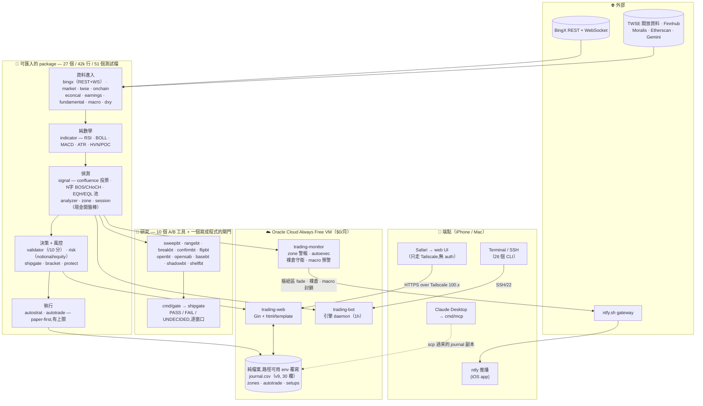

# trading-bot — 架構與設計決策（繁中版）

> 本檔是 `README.md` 的**繁體中文架構導覽**，不是全文翻譯。技術名詞（sweep /
> confluence / ship gate / EQH / POC / backpressure 等）保留原文。`> 💡` 開頭的
> 段落是**譯註**，原文沒有，用來補「為什麼這樣做」的背景。
>
> **刻意只翻一半。** 英文 README 有 1571 行，其中約 900 行是安裝、CLI flag 表、
> VPS 部署步驟 —— 那些內容本身就是 shell 指令，翻譯不會讓它更好懂，但會多出一份
> 必須同步維護的文件。這份只翻「理解系統需要的部分」；要跑起來請看 `README.md`。

---

## 這是什麼

一個個人的加密貨幣／合成標的交易輔助系統，跑在 Oracle Cloud Always Free 的
VM 上（$0/月）。它做三件事：

1. **偵測** — 從 K 線算出有名字的事件（sweep、BOS/CHoCH 結構、EQH/EQL 流動性池、
   籌碼密集區），投票成一個分數
2. **評估** — 把一個「提議的進場」打分（`/10`），並用風控層拒絕不該做的
3. **記錄與執行** — 30 欄的 CSV 交易日誌、紙上執行器、實盤下單與停損管理

規模：**27 個 importable package、26 個 command binary、約 42,000 行 Go、51 個測試檔**。

> 💡 這個專案真正的重點不是「會不會賺錢」，而是**每一個策略改動都要通過
> 60/90/120 天的 A/B 才能上線**，而那個閘門是寫成程式的（`shipgate`），不是
> 一個習慣。下面「研究工具」那節是整個 repo 最不尋常的地方。

---

## 一眼架構

---

## 架構分層

資料往下流，下層不回頭呼叫上層。

| 層 | Package | 責任 |
|---|---|---|
| **資料進入** | `bingx`（REST + WebSocket + 分頁 K 線）、`market`（Symbol/Candle 型別，14 個合約含 NCCO* 貴金屬與 NCSK* 美股合成）、`twse`、`onchain`、`econcal`、`earnings`、`fundamental`、`macro`、`dxy` | 所有對外讀取。`market.Resolve` 是**唯一**的 symbol 對照表 |
| **純數學** | `indicator` | 無狀態：RSI、BOLL、MACD、ATR、Fibonacci、volume profile（HVN/POC）。沒有 I/O、沒有時鐘 |
| **偵測** | `signal`（confluence 投票、N字 BOS/CHoCH 結構、EQH/EQL 流動性池、session 開盤價、shelf）、`analyzer`（sweep + reclaim、divergence、CVD、雙頂雙底）、`zone`（樞紐區帶，手動 + 自動推導）、`session`（美股現金開盤棒建模） | 把 K 線變成有名字的事件 |
| **決策 + 風控** | `validator`（`/10` 分）、`risk`（notional/equity、kill distance）、`shipgate`（PASS/FAIL/UNDECIDED）、`bracket`（裸倉守衛）、`protect`（停損管理） | 給提案打分，並拒絕不該做的 |
| **執行** | `autostrat`（規則 → 觸發）、`autotrade`（紙上開單、去重成一規則一部位、全域上限） | **Paper-first,沒得商量** |
| **紀錄** | `journal` | 30 欄 CSV，用欄位數當版本，讀取時自動遷移 v1→v9 |
| **輸出** | `notify`（stdout / macOS / ntfy 扇出）、`ansi`、`ai`（Gemini/Anthropic，支援 dry-run） | |
| **設定** | `config` | `.env` 載入器。**每一個資料路徑都可以用 env 覆寫** |

### 三個承重的不變式

**1. 引擎只讀收盤棒。** 未收盤的那根永遠不讀 —— 這是 live 和 backtest 結果一致的
唯一原因。成交問題要在**執行層**修，不准動引擎。

> 💡 這條規則來自一次真實的教訓：早期版本用當前棒的 high/low 做 sweep 偵測，那是
> 發警報當下還不存在的資訊（look-ahead bias），backtest 因此報出 live 不存在的
> edge。修法是加一個「丟掉未收盤棒」的 helper，讓兩邊看到完全相同的輸入。

**2. 一份 symbol 對照表。** `market.Resolve` 是唯一的。這條之所以要寫下來，是因為
它被違反過四次 —— `zone.ShortToSym`、`cmd/validate` 的區域 switch 等等各自維護了
一份副本，然後各自過期，造成「手寫的 zone 被靜默跳過」和「驗證器拒收 SNDK」這類
故障。

**3. 執行 paper-first,而且要三道開關。** 要真的下單需要：config 主開關 ON、
paper 旗標 OFF、**而且** env kill-switch 打開。任何一道沒開就不會有真單。

---

## 26 個 binary

| 分類 | Binary |
|---|---|
| **Daemon**（VPS 上由 systemd 管） | `web`（Gin UI）、`monitor`（zone 警報 · autoexec · 裸倉守衛 · macro 預警）、`serve`（引擎掃描迴圈） |
| **讀取 / 分析** | `analyze`（多標的快照，`-symbols` 可指定任何 `market.Resolve` 認得的）、`validate`（給提議進場打分）、`price`、`contracts` |
| **帳戶 / 交易所** | `acct`、`protect`（停損管理）、`wsprobe` |
| **資料抓取**（cron） | `earnings-fetch`、`fundamental-scan` |
| **紀錄** | `journal`（open/close/list/stats/update/delete） |
| **整合** | `mcp`（MCP server —— 讀同步過來的 journal 副本，讓 Claude Desktop 能查交易歷史） |
| **模擬器** | `backtest` |
| **研究** | 10 個 A/B 工具 + `gate`，見下節 |

---

## 研究工具，以及為什麼有十個

每個策略改動都要過 60/90/120 天的 A/B。**每一個工具的存在都是因為前一個回答不了
某個特定問題：**

| 工具 | 它要回答的問題 |
|---|---|
| `sweepbt` | sweep-reject 的參數曲面（目前上線的 edge） |
| `rangebt` | range-edge 的各種 arm，含方向與事件過濾 |
| `breakbt` | 破線回測 |
| `confirmbt` | 觸價進場 vs 收盤確認（答案：收盤確認，−0.12R/trade vs −0.41R） |
| `flipbt` | 關卡被破之後的極性翻轉 |
| `openbt` | session 開盤價對齊能不能預測結果（事後分桶） |
| `opensab` | **同一個問題但做對** —— 在 fire 生成端套過濾器，然後過 `shipgate` |
| `basebt` | 基準線，讓任何 arm 都有東西要打敗 |
| `shadowbt` | EQH/EQL/開盤價當影子訊號 |
| `shelfbt` | shelf-retest（**跑過並否決** —— 參數曲面沒有峰值） |

> 💡 `openbt` 和 `opensab` 的差別值得看一下，那是這個 repo 裡最好的一個方法論
> 教訓。`openbt` 產生所有 fire、去重、**然後**按開盤價對齊分桶。但在「一規則一
> 部位」的去重下，一個子群的 R **不等於**只交易那個子群的規則能拿到的 R ——
> 刪掉一個 fire 會釋放槽位、重置 cooldown，於是**不同的、後面的** fire 變成部位。
>
> 證據不是理論：BTC 60d 上 `mo-aligned` 這個 arm 產出的部位**比未過濾的基準線還多**
> （39 vs 30）。一個只會刪東西的嚴格子集過濾器做出更多交易，只有透過去重的交互
> 作用才可能。所以 `opensab` 把過濾器移進 fire 生成端，各 arm 獨立去重。

### `shipgate` — 閘門是程式，不是習慣

`cmd/gate` 把各窗口的數字餵進 `shipgate.Evaluate`，回傳 **PASS / FAIL /
UNDECIDED**，並且列出**每一條**沒通過的條件而不只是第一條。

判準：

- **逐窗口，不看聚合** —— 聚合會藏起一個虧錢的窗口
- **樣本數地板** —— 低於門檻回 UNDECIDED 而不是 FAIL（那是資料問題，不是結論）
- **絕對地板**：中位數 R/trade 必須大於零，不管基準線表現如何

> 💡 最後那條是整包東西的重點。一個**純相對**的閘門說不出「這兩個都不該交易」——
> 它只會挑出比較不爛的那個。絕對地板就是為了這件事加的。

---

## 工程決策與取捨

| 決策 | 為什麼是這個而不是那個 |
|---|---|
| **Sweep 用收盤確認失效，不只是影線穿刺** | 原本的偵測器在影線穿刺時就觸發，然後不再重新評估。Backtest 顯示它在 2026-05-27 XAG −2.4% 崩跌期間持續發出 LONG（前面棒留下的過期 sweep）。修法：只要後面任何一根棒**收盤**穿過被掃的關卡且方向相反，就殺掉那個 sweep。結果 60d/1h 聚合 **netR +10.91R → +19.97R（+83%）** |
| **HVN / 籌碼密集區只顯示，不投票** | 直覺說「順著籌碼區做」—— 但 backtest 顯示把 HVN 當 confluence vote 會用邊際訊號稀釋分數門檻，反而降低淨 edge（BTC −1R、白銀 −5.8R）。保留計算並顯示成 `·` 行供人判斷，引擎不投它。「讓 backtest 決定」的紀律贏過「相信直覺」的紀律 |
| **MTF bias filter 放在 opt-in 旗標後面** | 同樣的故事：強制高週期 MACD 方向會傷 ETH 的均值回歸 edge（+6.5R → −2.4R）。做成 opt-in 而不是刪掉，保留未來用新資料 A/B 的能力 |
| **停損外推（推過 HVN 群聚）也是 opt-in** | Backtest 顯示更寬的停損會壓縮 24 棒持有期內的 R 倍數（更多小虧 timeout、更少 2R 獲利）。**但模擬器無法模擬真實的獵停損滑價。** Opt-in 保留兩派說法，讓 journal 的實盤資料去裁決 |
| **Confluence 用投票模型，不用加權和** | 每個因子每根棒對每個方向最多投一票，分數 = max(多, 空)。比加權和簡單（超參數更少、小樣本下曲線擬合風險更低），而且票數是**可解釋的**（`LONG(3)` = 三個獨立因子同意） |
| **CSV 日誌，不用 SQLite/Postgres** | 單一 process 寫、幾乎只 append，操作者用 `jupdate` 手改。SQLite 會把 schema migration 變成一個工具問題；用 CSV 我拿欄位數當版本（v1→v9，目前 30 欄），第一次讀取時自動遷移。取捨：沒有並行寫入、沒有複雜查詢 —— 但這裡都用不到 |
| **Web UI 綁 Tailscale IP，不綁 0.0.0.0** | 三層防禦（Tailscale CGNAT + ufw + 綁定位址），任一層被破還有兩層。**不需要應用層 auth，因為網路層已經用 WireGuard 強制了身分。** 網路原語夠強的時候就信任它，不要外掛一個弱的 auth 當安全劇場 |
| **Range expansion 棒：投票 → 降級 → 再升級** | 原本是 vote；某次 backtest 出現標的-regime 依賴後降成只顯示；**後來因為一個 XAG 案例再升級** —— 引擎給了 9.0/10 的 LONG，同時偵測到一根 3-ATR 的看空 range-expansion 棒卻忽略它。後續 60 天 backtest 驗證：XAG 從 −8.65R 翻到 +0.66R。教訓：**單一 backtest 窗口是有雜訊的，有新證據時要重看舊決定** |

---

## 上線之後才學到的事

| 問題 | 診斷 | 修法 |
|---|---|---|
| **Daemon 的時間戳和 systemd 差 8 小時** | Go binary 的 `log.Printf` 預設 UTC，systemd journal 前綴是台北時間。同一行被切成兩個時區 | systemd unit 加 `Environment=TZ=Asia/Taipei` —— 把時區傳進 process，不只設系統層 |
| **關掉 iPhone 的 Terminal 就把 daemon 殺了** | `make serve` 前景執行會繼承 SSH session 的控制終端，斷線時 SIGHUP 傳播下去 | 加 `make serve-bg`（`nohup` + `disown`），並寫下「從 iPhone 跑一律用 serve-bg」的規則 |
| **結構崩壞期間過期的 sweep 持續觸發** | 就是那個「XAG 在 −2.4% 崩跌中出 LONG score=2」的事件。被掃的關卡被反向收復後，sweep 偵測沒有重新評估 | Sweep 失效邏輯（見上表第一列），並由 +83% 的 backtest 改善驗證 |
| **VPS 上用 `sudo` 改過 `journal.csv` 之後，web 寫不進去** | 用 root 編輯把所有權翻成 `root:root`，以 `ubuntu` 執行的 web daemon 不能再 append | 任何 `sudo` 動過的重寫之後，反射性 `chown journal.csv ubuntu:ubuntu`；現在是檢查清單項目 |
| **Backtest 報出的 edge 在實盤沒出現** | Look-ahead bias —— 早期版本用當前棒的 high/low 做 sweep 偵測（發警報當下還不存在的資訊） | 加「丟掉未收盤棒」的 helper，讓 live 和 backtest 在警報時刻看到完全相同的輸入 |

> 💡 這五個裡有四個的共同點：**顯示或紀錄和實際不一致**，而且都不是靠讀程式碼
> 發現的，是靠讀輸出發現的。這個 repo 後來長出很多「讓不一致自己喊出來」的測試，
> 原因就在這裡。

---

## 技術選擇與營運

| 層 | 選擇 |
|---|---|
| 語言 | **Go**（單一 binary 部署、好交叉編譯到 ARM/AMD64） |
| Web | Gin + `html/template`（server-side render，沒有 JS framework） |
| 持久化 | CSV（自動遷移 v1→v9，30 欄） |
| 推播 | ntfy.sh（免費） |
| 通知 | 可插拔的 `Notifier` interface（stdout / macOS / ntfy）+ `Multi` 扇出 |
| 網路 | Tailscale（WireGuard mesh，免費方案） |
| 主機 | Oracle Cloud Always Free（約 $0/月） |
| Process 監管 | systemd，`Restart=always` |

- **24/7 運行**，Oracle Cloud Always Free（E2.1.Micro）
- **三層安全模型**（Tailscale CGNAT + ufw + 綁定位址）
- **iPhone 優先的操作體驗** —— ntfy 推播、SSH alias、只走 Tailscale 的 web 面板
- **設定即資料**：daemon 的 TF / min-score 放在 `/opt/trading/.env`，systemd unit 用
  `${TRADING_TF}` 讀取，所以 `tconfig 15m 3` 就是完整的改設定-部署迴圈（約 1 秒）

---

## 已知限制

- **它現在會下單** —— 這句以前寫的是「永遠不下單」。`bingx/orders.go` 會下進場、
  停損、止盈；`protect/` 管理實盤停損；journal 記錄四個 order_id 欄位；`/ops/fills`
  對帳。三個要明講的後果：(a) 自動執行器是 **paper-first**，要 live 需要三道開關
  全開；(b) **綁定的停損可能靜默失敗**，所以每次進場都必須回頭對交易所查證
  （`/ops/verify`），不能相信 journal；(c) `bracket/` 跑一個伺服器端的裸倉守衛，
  因為 (b) 真的發生過
- **沒有滑價模型。** 限價成交假設完美；實際上薄的盤口會比 backtest 差
- **沒有計算持倉的資金費。** 日內尺度可忽略，跨多個結算週期就有意義
- **TP1 沒有被模擬。** Backtest 只在 TP2 或停損出場
- **黃金（XAU）是 CFD 型** —— 週末跳空、盤口薄。Backtest 顯示不獲利，目前建議排除
- **清算熱力圖沒有接。** `analyzer/liq_heatmap.go` 有 Provider interface 和
  `Cluster()`，但沒有實作。這是停損位置這塊最大的資料缺口
- **Backtest 樣本偏小**（1h、60 天下每個標的約 30–45 筆）。Edge 的信賴區間很寬

---

## 真正還開著的 / 確定否決的

英文 README 的 `## Roadmap` 有完整版。摘要：

**還開著**：per-symbol 分數門檻（已回測，XAG=3 有幫助，等實盤確認）· 清算熱力圖
provider · 自動執行器的 per-symbol 並發上限 · 現金開盤停損檢查移到進場前 ·
read-only demo build · fixture 識別碼測試

**確定否決**（留下紀錄避免重複討論）：

| 想法 | 判決 |
|---|---|
| 高週期 bias filter | 傷均值回歸 edge（ETH +6.5R → −2.4R）。上了 sweep 失效和 range-expansion 投票之後重看過，還是不行 |
| 引擎讀未收盤棒 | 破壞 live/backtest 一致性。收盤棒規則是承重的 |
| Shelf-retest 策略 | 跑過並否決：參數曲面沒有峰值 |
| 開盤價對齊當計分因子 | 2026-09-09 用 `opensab` 在 fire 生成端量測：三個 arm 在每個窗口都 FAIL |
| Proximity vote（離 HVN / EQH/EQL / 開盤價多近） | **距離會稀釋計數門檻。只有事件才計分。** 分三次被否決，每種關卡一次 |
| 名單外的新交易對 | 範圍紀律，名單刻意保持小 |

---

## 設計文件

點時間的決策紀錄，不是活文件 —— 讀它們是為了推理過程，當前行為看程式碼。

| 文件 | 主題 |
|---|---|
| `docs/auto_executor_design.md` | 自動執行器：明確的 IN/OUT 範圍、安全閘門、分階段推出、待簽核決定 |
| `docs/price_stream_design.md`（+ `.zh-TW`） | WebSocket 價格串流 |
| `docs/AI_ARCHITECTURE.md` | AI 顧問分層 |
| `docs/ai_analyze_upgrade_spec.md` | 標的分析的 prompt/context 排序 |
| `docs/ai_fanout_design.md` | 多 agent 綜合格 |
| `docs/struct_momentum_strategy_design.md` | StructMomentum，第二個策略 |
| `docs/fundamental_f3_earnings_spec.md` | 財報／基本面看板 |
| `docs/ui_overhaul_plan.md` | UI 階段 |
| `docs/MCP_SETUP.md` | MCP server 接線 |

有幾個 package 把推理放在 package doc 而不是 `docs/`，這幾個最值得先讀：

- `session/session.go` —— 為什麼 9:30 ET 那根棒需要自己一個 package（含 148 天的量測）
- `autotrade/caps.go` —— 為什麼零代表無限制
- `autotrade/blocked.go` —— 為什麼被擋掉的候選要記在獨立檔案

---

## 這份文件沒有的東西

安裝、`.env` 設定、每個 CLI 的完整 flag 表、Make target、Web UI 路由表、
iPhone/遠端工作流、Oracle Cloud 部署步驟、backtest 結果表、HVN 的交易用法 ——
**都在 `README.md`。** 那些內容是指令和表格，翻譯只會多一份要同步的東西。
